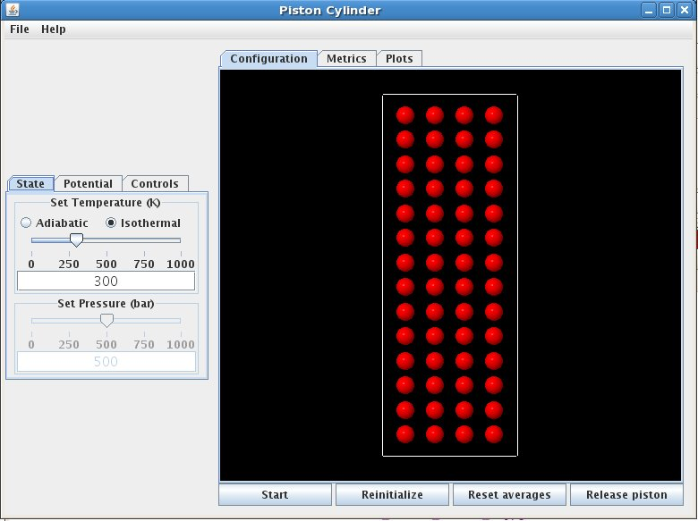
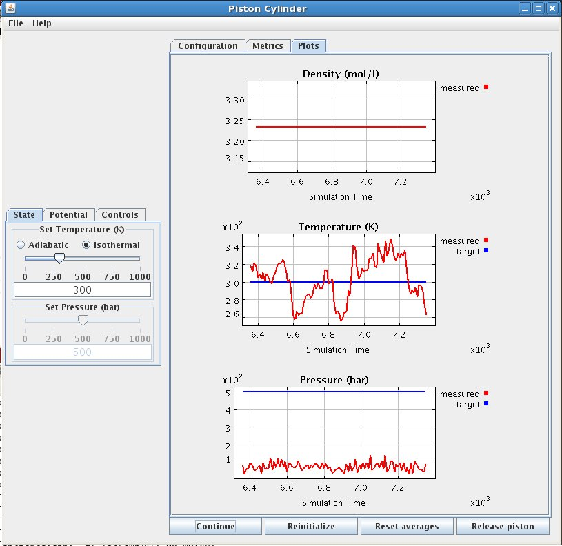
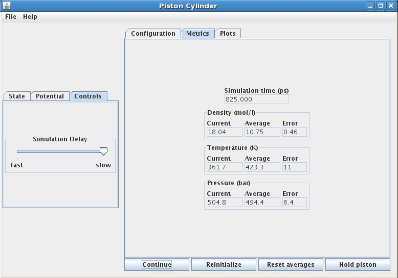

When the Piston Cylinder application is started, it should look something like this.

The left side of the display, referred to as the "Control Panel", contains controls that allow the user to interact with the simulation.

The "Control Panel" contains simulation start-up settings displayed in tabbed page format. On the "State" tab, the simulation can be set as adiabatic or isothermal (heat transfer buttons), and the initial temperature can be changed via the temperature slider. The initial pressure is set with the pressure slider (NOTE : The pressure cannot be changed until the piston is released by pushing the piston button). On the "Potential" tab, the intermolecular potential can be selected from one of the selections on the intermolecular potential menu. The intermolecular potential defines how the molecules interact.  The "Controls" tab contains a slider that can control the speed  of the simulation.

The middle section of the display is referred to as the "Grahpics Panel".

On the bottom of the "Graphics Panel" is the "Control Box", which contains buttons that :

1. Start and stop the simulation (start button)
1. Restart the simulation from its initial state (reinitialize button)
1. Reset averages by discarding any previous contributions (reset button)
1. Hold or release the piston, permitting the simulation to run at fixed pressure or fixed density (piston button)

The "Graphics Panel" contains a visualization of the simulation and data plots displayed in a tabbed page format.

The "Configuration" tab contains the piston-cylinder graphic (as shown on the picture above) which shows the atoms as filled circles, and the piston-cylinder as the walls surrounding them.  The "Plots" tab presents the system density (density graph), temperature (temperature graph) and pressure (pressure graph) in a graphical format (as shown on the picture below). For the temperature and pressure, both measured and target values are displayed. The target values are those set by the sliders on the "Control Panel". The measured temperature is derived from the total kinetic energy of the atoms, which when averaged appropriately should equal the thermodynamic temperature. Fluctuations in the kinetic energy lead to fluctuation in the target temperature. Likewise, the measured pressure is derived from the forces of collision of the atoms with the piston surface. It too is a fluctuating quantity. You might notice that the magnitude of the fluctuations in temperature and pressure diminish as you select larger numbers of molecules in the simulated system.

The "Metrics" tab display the current and average temperature (temperature boxes), density (density boxes) and pressure (pressure boxes) (average using data taken since the beginning of the simulation, or since the last time the reset button was pressed).

