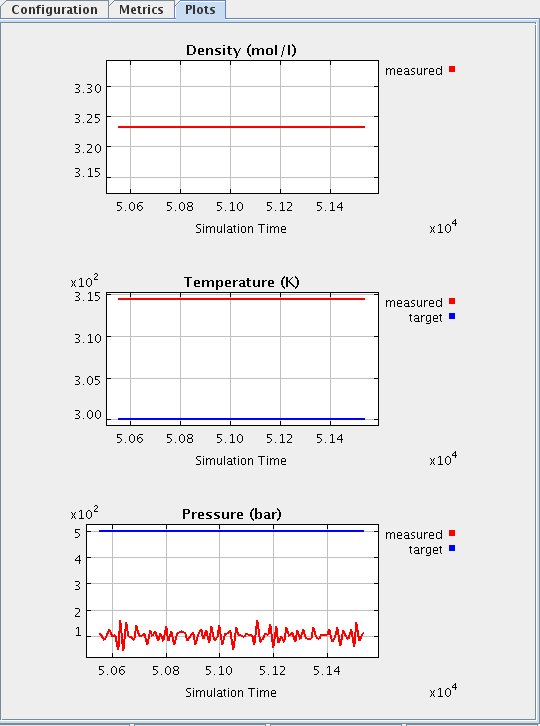

{{SimInitialize-nav}}  Next, verify that the piston is not in motion. The piston is not in motion if the piston button is labeled "Release Piston". If the piston button is labeled "Hold piston", push that button.

Set the initial conditions (Any parameter not mentioned should be left at the default):
* Use a simulation in 3D space
* Set Temperature : Adiabatic
* Pressure : 500
* Number of Molecules : 100 (this is not editable)
* Intermolecular Potential : Ideal gas

Start the simulation by pushing the start button. The piston should remain stationary. The current density and current temperature should remain constant (and can be verified by viewing the plots and data display boxes) even though the system is adiabatic. The graphs and display boxes should be similar to:

Why does the simulation behave in this manner? Look at the pressure graph and notice that the measured and target pressure do NOT coincide. The target pressure is not relevant when the piston is held fixed. The pressure can be evaluated by looking at the measured value on the graph. It may fluctuate significantly about some average value. You should see no fluctuation in the density, temperature or the target pressure.