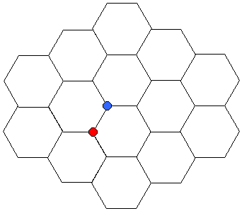

A lattice is a regular, periodic array of points in space. The molecules in a (perfect) crystalline solid arrange themselves onto the sites of a lattice, adopting structures that largely determine the bulk properties of the solid. But the notion of a lattice is a purely mathematical construct, and lattices are often subject to description and study in quite abstract terms. In particular, the notion of symmetry is very important in connection to lattices. A lattice is symmetric with respect to some operation---such as rotation about an axis by, say, 90 degrees---if it is unchanged by the operation. By this we mean that the lattice sites (if considered as indistinguishable) do not seem to have been moved from their original positions after the operation has been performed.

Lattices are categorized by the types of symmetries they exhibit, such that lattices in different groups exhibit a different set of symmetries---for instance, lattices in one group might be unchanged by a 90-degree rotation, while those in another are symmetric with respect to 60-degree rotations. For three-dimensional lattices, there are only fourteen such groupings. Bravais was the first to reach this conclusion correctly and, appropriately, lattices of the type discussed here are known as Bravais lattices. If one restricts the allowed symmetry operations to only those that leave one (distinguishable) atom unmoved, then there are only seven possible groupings, known as the seven crystal systems. These are enumerated on another page in this section.

Some structures look at first glance to be lattices, but in fact are not. A good (2-dimensional) example is the honeycomb structure, with each intersection considered as a site.

A criterion for a structure to be a lattice is that each site must be equivalent, meaning that its surroundings does not depend on its location.  In this example, the sites indicated by the red and blue circles are not equivalent---among other differences, the red site has a neighbor to its immediate left, while the blue one instead has a neighbor to its right. In the same way, the three-dimensional diamond structure is also not a true lattice. Both of these examples can instead be viewed as a lattice with a multiatomic basis---more on that concept on another page.