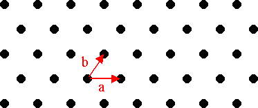
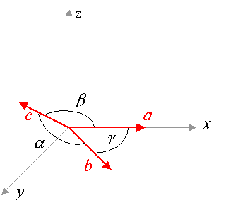

A three-dimensional space lattice can be fully defined using just three (non-coplanar) vectors.  The lattice is constructed by placing a point at every possible combination of the three vectors and any multiples of them (positive or negative).  The vectors used for this operation are known as the *primitive vectors* for the lattice. A given lattice can be constructed from different sets of primitive vectors, so there is no uniquely prescribed set of primitive vectors associated with a lattice. However, a given set of primitive vectors does uniquely define a Bravais lattice.  Here's an example of a 2-dimension lattice, with suitable primitive vectors shown.

Examine the honeycomb structure on the Lattices page, and convince yourself that no pair of vectors can be defined such that they combine to give all points in the structure, without also having combinations that give points not in the structure.

We denote the primitive vectors as **a**, **b**, and **c** (for a 3-dimensional space). If we adopt a convention such that the vector <b>a</b> points along the *x*-axis, and the vector <b>b</b> lies in the *x*-*y* plane, then we need only six numbers to complete the specification. We take these as the respective lengths (*a*, **b**, and *c*) of the three vectors, and the three angles (alpha, beta, and gamma) formed by the vector pairs **bc**, **ac**, and **ab**, respectively. You can form any Bravais lattice by appropriate selection of these six values. The CrystalViewer module permits you to edit these values and observe the resulting crystal defined by the corresponding primitive vectors.

