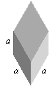

The seven crystal systems group lattices according to the certain symmetries that they have in common. Each system can be specified in terms of particular restrictions that are placed on the primitive vector lengths and angles. The crystal systems are listed in the following table, which indicates the restrictions on the primitive vectors needed to maintain the symmetry of each system.

```
<table width="415" cellspacing="0" cellpadding="2">
  <tr>
    <td bgcolor="#555555">
      <div align="center"><b>System</b></div></td>
    <td bgcolor="#555555">
      <div align="center"><b>Restrictions</b></div></td>
    <td bgcolor="#555555">
      <div align="center"><b>Illustration</b></div></td>
  </tr>
  <tr>
    <td bgcolor="white">Triclinic</td>
    <td bgcolor="white">$a \ne b \ne c$

                        $\alpha \ne \beta \ne \gamma$</td>
    <td bgcolor="white"></td>
  </tr>
  <tr>
    <td bgcolor="#dddddd">Monoclinic</td>
    <td bgcolor="#dddddd">$a \ne b \ne c$

                          $\alpha = \gamma = 90^\circ, \beta > 90^\circ$</td>
    <td bgcolor="#dddddd"></td>
  </tr>
  <tr>
    <td bgcolor="white">Orthorhombic</td>
    <td bgcolor="white">$a \ne b \ne c$

                        $\alpha = \beta = \gamma = 90^\circ$</td>
    <td bgcolor="white"></td>
  </tr>
  <tr>
    <td bgcolor="#dddddd">Tetragonal</td>
    <td bgcolor="#dddddd">$a = b \ne c$

                          $\alpha = \beta = \gamma = 90^\circ$</td>
    <td bgcolor="#dddddd"></td>
  </tr>
  <tr>
    <td bgcolor="white">Trigonal
(Rhombohedral)</td>
    <td bgcolor="white">$a = b = c$

                        $\alpha = \beta = \gamma$</td>
    <td bgcolor="white"></td>
  </tr>
  <tr>
    <td bgcolor="#dddddd">Hexagonal</td>
    <td bgcolor="#dddddd">$a = b \ne c$

                          $\alpha = \beta = 90^\circ, \gamma = 120^\circ$</td>
    <td bgcolor="#dddddd"></td>
  </tr>
  <tr>
    <td bgcolor="white">Cubic</td>
    <td bgcolor="white">$a = b = c$

                        $\alpha = \beta = \gamma = 90^\circ$</td>
    <td bgcolor="white"></td>
  </tr>
</table>
```