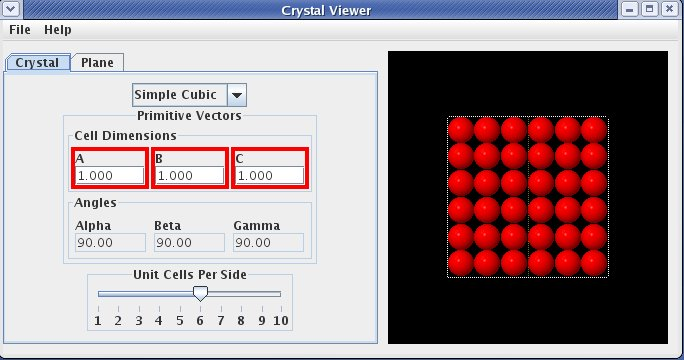
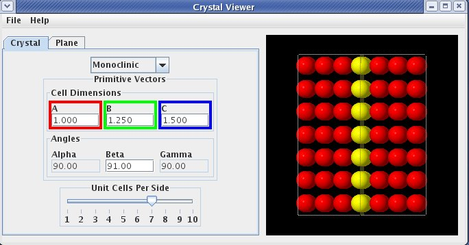
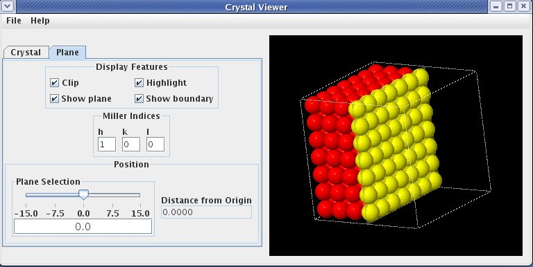
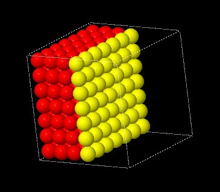
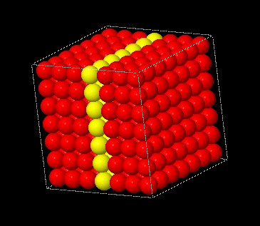
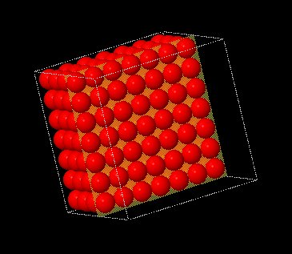
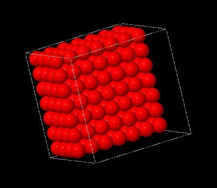

When the Crystal Viewer application is started, it should look something like this.





The left side of the display, referred to as the "Control Panel", contains controls that allow the user to interact with the simulation. 
The "Crystal " tab (**crystal tab**) has a drop-down menu (**crystal selection**) that allwos the user to select different crystal structures.

Below the **crystal selection** are text boxes where the lengths of the three primitive vectors, **a vector**, **b vector**, and **c vector** can be changed. Not all vectors can be adjusted independently for all crystal structures. That is to say, changing the length of the **a vector** may also (automatically) change the length of the **b vector**. Vectors which have values that are tied together are denoted by the color of the surrounding box. Changing the length of a vector with a red surrounding box will automatically change all other vector lengths with a red surrounding box. The lengths are given in units such that each sphere is of unit diameter.

Next are text boxes where the angles between vectors can be adjusted (**alpha**, **beta** and **gamma**). Some crystal structures require that some or all of these angles remain constant, and in those cases, the angles cannot be changed by the user. The angles are measured in degrees.

The last item on the **crystal tab** is a slider (**cells per side slider**) that allows the user to change the size of the crystal. The values on the slider indicate the number of planes repeated in each primitive-vector direction.

In the image shown below, the values are : 
crystal selection is Monoclinic 
* a vector is 1.0 
* b vector is 1.25 
* c vector is 1.5 
* beta is 91 
* cells per side slider is 7

All vector lengths can be adjusted independently as the boxes surrounding them are different colors. The beta angle is the only angle that the user can adjust.





The second tab on the "Control Panel" is the **plane tab**. The **plane tab** primary purpose it to allow the user to select the crystal's plane to view. Additionaly, several graphic options can be toggled. The **plane tab** is shown below.





The "Display Features" section contains buttons to turn on/off various graphic related features. The **clip button** clips the right side of the crystal to the currently select plane as shown below :


```
<table width="100%">
<tr>
<td width="50%" align="center">
Clipping On
<td width="50%" align="center">
Clipping Off
</tr>
<tr>
<td width="50%" align="center">

<td width="50%" align="center">

</tr>
</table>
```


The **highlight button** colors the molecules that are in the currently selected plane yellow so they are easy to identify. Molecules not in the currenly selected plane remain red. 

The **show plane button** displays a "thin transparant sheet" through the currently selected plane position as shown below :


```
<table width="100%">
<tr>
<td width="50%" align="center">
Show Plane On
<td width="50%" align="center">
Show Plane Off
</tr>
<tr>
<td width="50%" align="center">

<td width="50%" align="center">

</tr>
</table>
```


The **show boundary button** toggles the display of the white frame surrounding the crystal.

The Miller indices can be controlled by the user with the **h miller indices**, **k miller indices** and **l miller indices** values. Negative indices are entered using a minus sign (no overbar is used).

The slider (**plane selection slider**) below the Miller index allows the user to move the plane to different positions at fixed orientation. If clipping is turned on, planes of atoms will appear or disappear as the plane is moved. The slider moves the plane continuously. The text box next to the **plane selection slider** displays the distance from the origin in unit vector increments.

On the right is the "Graphics Panel" which contains an image of the crystal. Although the image appears two dimensional, the crystal is actually three dimensional.

The following table outlines the features available for manipulating the three dimensional figure.


The following table outlines the features available for manipulating the three dimensional figure.

```
<table width="80%" border="2">
<tr>
<td width="35%" align="center">
<b>Key/Mouse Combination</b>
<td width="65%" align="center">
<b>Function</b>
</tr>
<tr>
<td width="35%" align="left">
h
<td width="65%" align="left">
Move figure to home (original) position.
</tr>
<tr>
<td width="35%" align="left">
r
<td width="65%" align="left">
Center the figure on the display.  If the figure is rotated, it will remain rotated.
</tr>
<tr>
<td width="35%" align="left">
x or X
<td width="65%" align="left">
Rotate figure around the X axis.  Case of letter determines direction of rotation.
</tr>
<tr>
<td width="35%" align="left">
y or Y
<td width="65%" align="left">
Rotate figure around the Y axis.  Case of letter determines direction of rotation.
</tr>
<tr>
<td width="35%" align="left">
z or Z
<td width="65%" align="left">
Rotate figure around the Z axis.  Case of letter determines direction of rotation.
</tr>
<tr>
<td width="35%" align="left">
=
<td width="65%" align="left">
Zoom in on center of graphic.
</tr>
<tr>
<td width="35%" align="left">
-
<td width="65%" align="left">
Zoom out on center of graphic.
</tr>
<tr>
<td width="35%" align="left">
p
<td width="65%" align="left">
Toggle &quot;perspective&quot; on/off.
</tr>
<tr>
<td width="35%" align="left">
1 - 9
<td width="65%" align="left">
Set the number of &quot;shells&quot; to display.
</tr>
<tr>
<td width="35%" align="left">
i
<td width="65%" align="left">
Toggle &quot;shell&quot; display on/off.
</tr>
<tr>
<td width="35%" align="left">
a
<td width="65%" align="left">
Toggle molecule display on/off.
</tr>
<tr>
<td width="35%" align="left">
Left Mouse Button + Mouse Drag
<td width="65%" align="left">
Rotate the figure in the direction of the mouse drag (only applicable to X and Y axis.
</tr>
<tr>
<td width="35%" align="left">
Right Mouse Button + Mouse Drag
<td width="65%" align="left">
Move the figure in the direction of the mouse drag.
</tr>
<tr>
<td width="35%" align="left">
Ctrl + Left Mouse Button + Mouse Drag
<td width="65%" align="left">
Set depth percentage.
</tr>
<tr>
<td width="35%" align="left">
Ctrl + Right Mouse Button + Mouse Drag
<td width="65%" align="left">
Set slab percentage.
</tr>
<tr>
<td width="35%" align="left">
Shift + Left Mouse Button + Mouse Drag Up
<td width="65%" align="left">
Zoom in on center of graphic.
</tr>
<tr>
<td width="35%" align="left">
Shift + Left Mouse Button + Mouse Drag Down
<td width="65%" align="left">
Zoom out on center of graphic.
</tr>
<tr>
<td width="35%" align="left">
Shift + Right Mouse Button + Mouse Drag
<td width="65%" align="left">
Inertially rotate in direction of mouse drag.
</tr>
<tr>
<td width="35%" align="left">
Shift + Right Mouse Button Click
<td width="65%" align="left">
Stop Inertial rotation.
</tr>
<tr>
<td width="35%" align="left">
Ctrl + Shift + Left Mouse Button Drag
<td width="65%" align="left">
Rotate around the Z axis.
</tr>
</table>
```