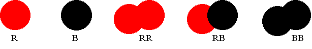

The system we look at here consists of two atomic species.  We distinguish them by their color, red or black.  These atoms can combine to form three dimer species.  All five species are depicted here

Among these we can form three independent reactions

$$
R + R \rightleftarrows R_2
$$

$R + B \rightleftarrows RB$

$B + B \rightleftarrows B_2$

A separate set of parameters $\sigma$, $\kappa$, and $\varepsilon$ can be defined for each pair interaction.  We use the same value of $\sigma$ for all atom-pair interactions, so that each atoms can be ascribed and drawn with an unambiguous size.  The other parameters,  $\kappa$ and $\varepsilon$ we allow to be varied independently for each pair.  In this way we can adjust the standard enthalpy, entropy, and free energy of each dimer independently.