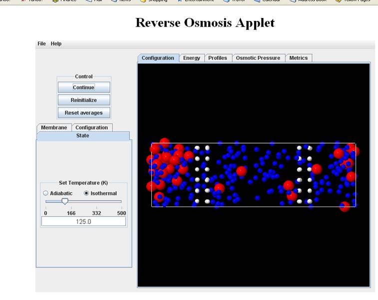
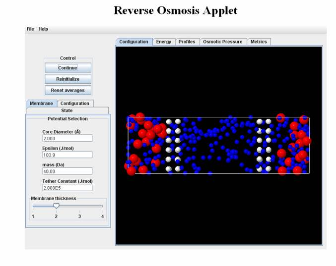
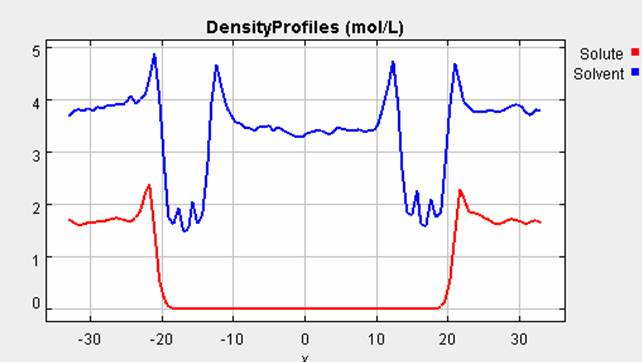
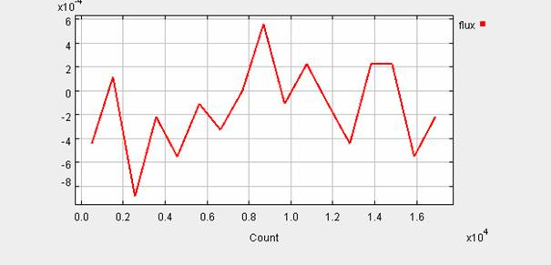
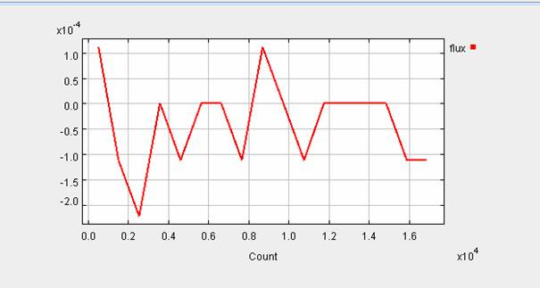
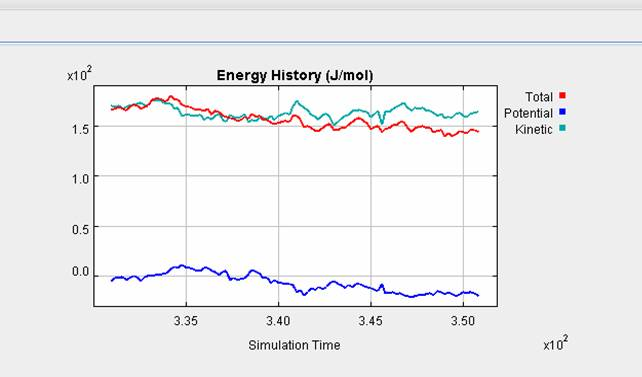

**Use the LJ version of the program with the following parameters**

**Membrane:**

Core Diameter: 1.5A

Others: Default

**Configuration**

Solute Mole Fraction:0.25

Others: Default

**State:** 

Isothermal: 125 K

Start the program and you will observe that the solute molecules can cross the membrane.

This means that the membrane does not have 100% selectivity; 

**Problem 1: Can you tell whether the system is undergoing osmosis or reverse osmosis? and why?**

Now increase the membrane core diameter size till you see observe that no solute molecules cross.

**Problem 2: Compare the osmotic pressure in the two cases. Which is higher and why?**

Finally calculate the pore size of the membrane and compare it to the size of the
solute molecule when they can no longer cross the membrane. 

**Problem 3: Is the pore size larger than the solute size? If not why did the solute molecules succeed in crossing the membrane?**

**Problem 4.**
With the LJ simulation program, change the following default values.

Configuration

Solvent and Solution Density: 5.1 mol/l; solute concentration: 0.34

State: Change to Isothermal 125K

Start the program and wait till it reaches equilibrium. Examine the density profiles till they look symmetric and uniform away from the membrane.

Calculate the osmotic pressure using the ideal solution law (you can calculate densities needed from the density profiles). Compare with the values obtained from the simulator and explain any differences. If you wanted to increase agreement which variables would you change. Run the program with these changes and check if your prediction was correct

**Problem 5: Effect of Membrane Thickness on Flux**

Using the LJ program you can set the parameters as follows with the membrane thickness being either 1 or 2.

Membrane: Core: 4.0A

Configuration: Solvent Density: 7.5; Solution Density=9.9; Solute Mole Fraction=0.5

State: Isothermal 125K 

Now examine the flux plots and calculate the average flux (by roughly averaging the area under the curve). In continuum fluid mechanics the flux is inversely proportional to thickness of the membrane. Does that
hold for such nano-systems and such short averaging times?

Thickness: 1

Thickness: 2

**Problem 6: Variations in Kinetic, Potential and Total Energy During a Simulaion**

For the second case (membrane thickness=2) of Problem 5 the energy profiles look as following. You will notice that while the kinetic energy stays constant
(with fluctuations, since this is an isothermal simulation), the total energy and kinetic energy is drifting downwards. Based on your understanding
of thermodynamics can you explain this trend. Now run the same case adiabatically. Examine the energy history and discuss the differences

