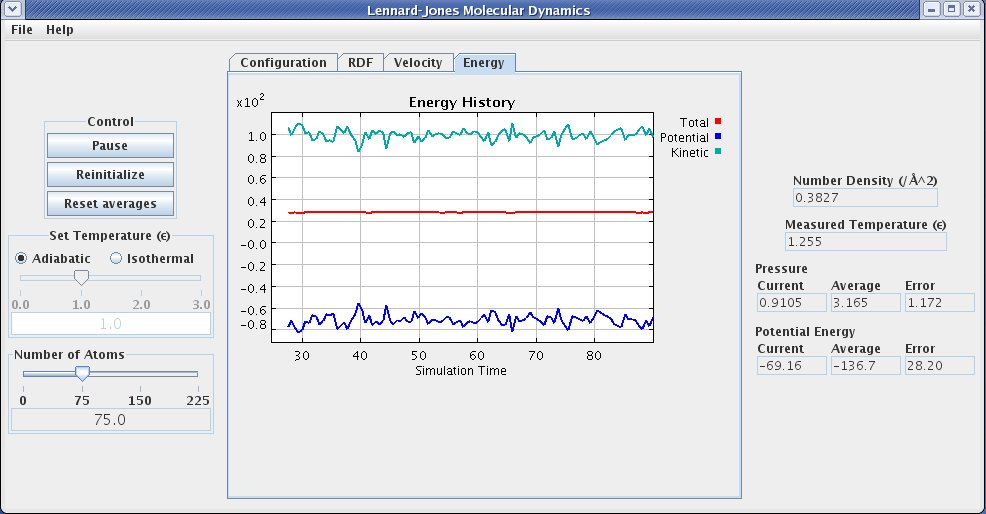
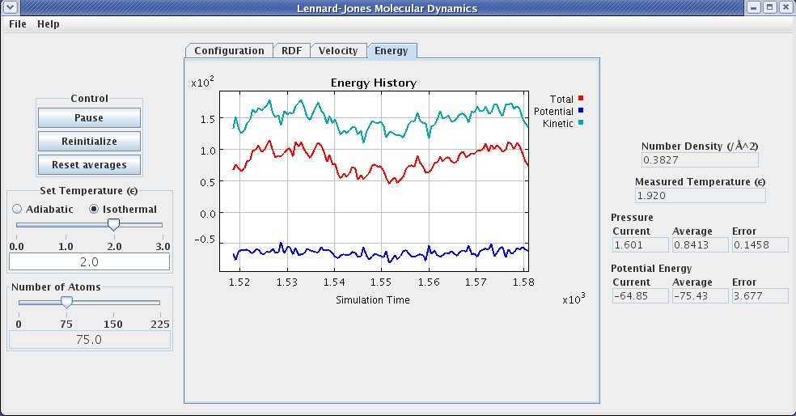

Start the simulation and observe the motion of the atoms.  Click on the **energy tab** to view a data plot showing the instantaneous values of the total energy and its potential and kinetic components, similar to the figure below.  Note that the total energy does not fluctuate while its component contributions do.

Pause the simulation and change the temperature (with the **temperature slider**) to a setting of 2.0.  Restart the simualtion.  Notice that the total energy, potential energy and kinetic energy all fluctuate.  Observe that the fixed value of the kinetic energy is consistent with the set temperature for the total number of atoms in the simulation. (the kinetic energy given here is extensive, increasing proportionally with system size; note also that the values plotted should be multipled by 100, as indicated in the scale of the plot)

