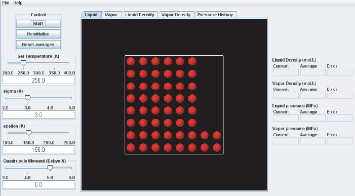

When the VLE module is started it looks like this:

The left side of the display, referred to as the "Control Panel", contains controls that allow the user to interact with the simulation. 

The first item on the "Control Panel" is the "Control Box", which contains buttons that :

1. Start and stop the simulation (**Start** button) 
1. Restart the simulation from its initial state (**Reinitialize** button) 
1. Reset averages by discarding any previous contributions (**Reset averages** button)
1. Expand the box to allow the formation of the vapor phase (**Expand** button)

The bottom of the “Control Panel” contains simulation start–up settings that can be adjusted by using sliders
or by typing in a numerical value. These simulation parameters are the temperature *T* in Kelvin, the two
LJ parameters, $\varepsilon$ (“epsilon”) and $\sigma$ (“sigma”), and the quadrupole moment *Q*. regarding the units see the description of the **Virial** module.

The center section of the display is referred to as the “Graphics Panel”. The Graphics Panel contains a
visualization of the simulation and data plots displayed in a tabbed page format. The “Liquid” and “Vapor”
tabs show the atoms in the simulation boxes for the liquid and vapor phase as filled circles. There are
200 atoms in each box when the simulation is started. The boxes can be rotated interactively before and
during the simulation to inspect the configurations in the liquid and vapor phase in detail. The next two
tabs display continuously updated graphs of the liquid and vapor density plotted versus the Monte Carlo
integrator step. The “Pressure History” tab displays graphs for the pressures in both phases vs. integrator
step. As the Gibbs–ensemble Monte Carlo simulation proceeds, atoms may move from one phase to the
other while equilibrium is being established.

On the far right hand side of the window is the “Data Display” panel. It lists numerical values of some of
the main results of the simulation which are updated continuously while the simulation is running (Current
value = value calculated for this integrator step, runningAverage, and statistical Error are listed for for each):
the density in the liquid phase (“Liquid Density”), the density in the vapor phase (“Vapor Density”), and the
corresponding pressures in the two phases (fields “Liquid pressure” and “Vapor pressure”, respectively).