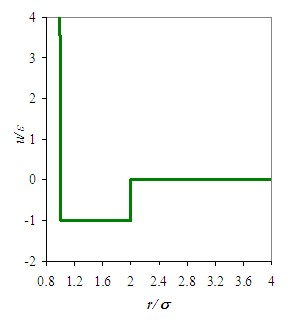
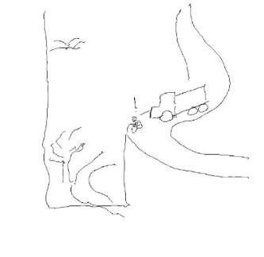

Molecular simulation is not necessary for understanding the basic definitions of terms like temperature, pressure, and energy, but it can provide helpful insights to complement the intuitive arguments that are normally developed.  While some students may readily absorb equations describing motion, other students might benefit from first observing the motion, including prompts about peculiar features.  There are limits to the kinds of systems that can be solved exactly by intuition alone, and some students may not immediately recognize the relation between the model system and the experimental system.  This module accommodates these various learning styles by providing graphical illustrations of the dynamics with potential models that can be made systematically more sophisticated.  While the ideal gas is amenable to analytical solution, hard spheres and square well attractions require the numerical solution inherent in molecular simulation.  A potential model with attractions is necessary to illustrate the transformations between potential energy and kinetic energy that give rise to temperature fluctuations.  Watching this transformation and correlating it with the temperature dynamics can expedite students' appreciation for the conservation of energy and the role of heat capacity.  Making the transition from the microscopic behavior of a few particles to the macroscopic behavior of a fluid may not be instantly assimilated by all students, but a systematic approach to large systems (the thermodynamic limit) is possible through simulation.  This systematic and graphical approach may instill a mindset of continually developing and improving model systems and equations of greater sophistication in students of wider ranging backgrounds. 

This module may seem different from other etomica modules.  Other etomica modules focus on relatively unfamiliar phenomena, like the Joule-Thomson coefficient.  On the other hand, the fundamental perspective on temperature, pressure, and energy may be unfamiliar to beginning students, and beginning students matter too.  This module is also different in that it is not a single module.  Rather, it draws connections between three distinct modules: the piston-cylinder, 2D disks, and 3D spheres.  On the other hand, drawing these connections does not diminish the individual modules and may actually help to convey the advantages and limitations of each one.

All the fundamentals of thermodynamics are embodied in Newton’s laws of motion applied to systems of colliding atoms.  Recognizing this, we would like to have a tool for analyzing atomic motions to infer the general rules that dictate the large-scale behavior.  This tool need not be capable of solving all the world’s problems.  It simply needs to provide a rigorous basis for exploring the phenomenology such that it can be characterized through model equations.  Building connections with the real world can be approached by matching the phenomenology of the model equations to experimental data.(cf. [Example 8](http://rheneas.eng.buffalo.edu/wiki/DMD:Example_8), [Problem 2.6](http://rheneas.eng.buffalo.edu/wiki/DMD:Problems:Level_2))

These model equations include the first and second laws of thermodynamics but they also provide broader capability.  Conservation of energy (the first law) is implicit in Newton’s first law.  The generation of entropy (second law) through molecular motions is clear as one watches the initially ordered crystal melt into a random fluid.  The broader capability is realized in the exploration of temperature, pressure, energy, and density, ultimately leading to equation of state and activity models.  These models can tolerate a fair amount of imprecision as long as empirical data are implemented near the range of application.  Then the models can be used to interpolate and extrapolate the available data.  Sounder fundamentals lead to more reliable extrapolations. This is the context for introducing molecular dynamics simulation in a course covering thermodynamics.

Newton’s laws require assumptions about the forces between atoms.  Frankly, accurate characterization of these forces for all molecules under all conditions is a subject of current research, but we can achieve our semi-empirical goals with relatively simple approximations.  Our approximation for the force laws is characterized by the square well (SW) potential.  The SW potential includes the phenomenology of attractions and repulsions and exhibits solid, liquid, and vapor phases, as observed in more complex solutions.

The SW potential is illustrated in Figure 1a.  The potential energy is the work (force times distance) required to bring two molecules together from infinite separation.  Realistically, we would expect this energy to be a smoothly varying integral of force times distance as the force is varying (e.g. $r^{-2}$ for the earth and moon).  The SW potential simply characterizes this energy as zero until it becomes significant(at a distance of r/σ=λ), then it is equally significant (with energy of -ε) until it becomes “impossible.”  Impossible means that infinite work is required to put two things in the same place at the same time(at r<σ).  Infinity is a mathematical way of saying “impossible.”  An analogy can be drawn to a truck running off a mountain road (Figure 1b).  To recover, you would not consider dragging the truck up the tall mountain, so we call it infinitely repulsive.  Dragging the truck along the valley is no big deal compared to dragging it back up to the road, so we assume that requires practically zero work.  Raising the truck up a steep embankment would be similar in work to lifting it straight up with a crane, so we equate the two.  The truck is attracted to the mountain in the sense that it gets stuck once it comes too close.  This simple conceptual picture sufficiently covers the phenomenology of attraction and repulsion.

One advantage of the SW potential is that the key dynamics and many of the computations are familiar to sophomores through the standard course in physics in the context of a special case: the hard sphere (HS) model.  The HS model is obtained by setting the depth of the attractive well (-ε) to zero.  We can further simplify our analysis by limiting the study to two dimensions (2D), in which case the hard spheres are really more like hard disks (HDs).  In this case, students might recognize an air table.  The treatments in the piston-cylinder and 2D models are nothing more than analyzing the motions of hard disks on a frictionless table.


**Figure 1a. The square well potential model. ______________________  1b. The falling truck analogy**

```
<table width="90%">
<tr>
<td width="50%">

<td width="50%">

</tr>
</table>
```


 
u(r) is the pairwise potential energy.  
ε characterizes the attraction between molecules. 
σ, the molecular diameter, characterizes the size.
λ=r/σ, set to 2.0 above, characterizes the range of interaction. See also the Basic Layout link for a list of symbols and notation. 


SW motions are discontinuous.  For the HD case (ie. when ε=0), the two disks collide and their directions are “instantly” altered.  In the presence of SW attractions, there are four possibilities: (a) collision: (b) association (c) dissociation (d) bounce.  Collision occurs when the repulsive cores make impact, just like the HD case.  An association occurs when two unbound disks come close enough for their wells of attraction to reach each other.  At that point, the potential energy is converted to kinetic energy and the molecules rush toward each other. (Isn’t that romantic?)  The SW model treats this as an instantaneous change, whereas a Lennard-Jones or Sutherland model would treat attraction as a continuous increase in energy like gravitational attraction.  This is probably the biggest approximation of the SW model.  Note that the %change in kinetic energy would be small if the molecules were already moving very fast.  This is why the importance of attractive forces diminishes at high temperatures, and the results at T=∞ are the same as ε=0.  Dissociation is simply the opposite of association.  The bounce interaction is subtle.  It occurs when two molecules are moving in opposite directions, but their kinetic energy is insufficient to overcome their attraction.  Then the molecules reverse direction and head for another (HD) collision.  Since all of these events occur instantaneously, the motion is fundamentally discontinuous.  For this reason, we refer to this molecular simulation model as discontinuous molecular dynamics (DMD).
 
The discussion below focuses on a detailed derivation for the collision events.  The derivations for the attractive interactions are treated elsewhere.  In fact, the equations for the collision and bounce interactions are identical because there is no change in kinetic energy in either case.  The equations for capture and dissociation incorporate the transformation of potential energy into kinetic energy.

At the end of this module, students should come away with a better understanding of several issues.  First, students should understand how the various potential models (ideal gas, HD, HS, SW) lead to different models of molecular motion.  This understanding should include the ability to judge when to choose one model over the other.  Second, students should develop a better understanding of density, temperature, pressure, and energy.  For example, conservation of energy may seem straightforward, but what happens to the temperature when a capture interaction occurs?  Pressure is force per unit area, but how does that change when you vary the potential from ideal gas to SW?  Third, students should develop an appreciation for model equations.  In principle, these may seem superfluous.  After all, we can simply run a simulation any time we need to estimate a pressure or density.  So why bother with “simplified” model equations?  The model equations give us the ability to quickly judge the impacts of various changes.  For example, suppose the temperature goes up inside our tire as we ride our bicycle on a hot day.  Will the pressure go up or down?  Should you need to run a simulation to answer this question?  In the end, students might be tempted to say that the model equations are the only important outcome, but they need to remember that the model equations here treat only SW disks and spheres, while real molecules are more complex.  We can enhance the sophistication of the potential model to capture some of these complexities, but there is always some level of detail that is missed.  So the important outcome is the process of observing behavior and developing a model, then refining the model equations to characterize the phenomena that are essential to the topic of interest.  This interplay between observation, conjecture, theory, and model refinement is key to scientific study, whether the specific subject is thermodynamics or astrophysics.

This introduction is organized according to the outline in the right column. The background section covers the fundamental equations to compute one collision sequence by hand.  After that, the computer is ideal for the next billion collisions.  The background also explains how the simulation results can be analyzed to infer more general lessons and practical models.  The basic layout includes a table of notation. It also explains how to interact with the various simulators.  If you prefer to just start simulating, click the "simulator" link.  The examples start with simple hand calculations then lead through demonstrations of the simulators.  The homework problems are divided into three levels.  The first level resembles the example problems with different numbers, the second level leads through the inference of model equations.  The third level addresses conceptual issues that probe detailed understanding of the fundamental model and how it is simulated.  We would love to improve any aspect of the module that needs help.  Please send your suggestions to: jelliott@uakron.edu.
