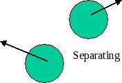
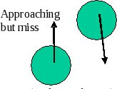
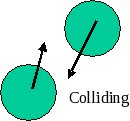

The relationship between time and position gives:


$(1) r_{ij} = r_i - r_j = (r^0_i + u_i(t-t_0)) - (r^0_j + u_j(t-t_0)) $
 $= (r^x_{ij}, r^y_{ij}, r^z_{ij})$

  
where $r_i$ is the vector $(r^x_i, r^y_i, r^z_i)$ position of the $i^{th}$ particle and $ u_i$ is the vector velocity.  

Note: html to make bold typeface for vectors in math mode is unknown to this author. Sorry.

At the time of contact, $t^c_{ij}$, we have ,


$(2) \sigma^2_{ij} = (r^c_{ij})^2 = \{(r^0_i + u_it^c_{ij}) - (r^0_j + u_jt^c_{ij})\}^2 $
 $\equiv \{(r_{ij} + u_{ij}t^c_{ij})\}^2 = \{r_{ij} \bullet r_{ij} + 2t^c_{ij}r_{ij} \bullet u_{ij} + u_{ij}(t^c_{ij})^2\}$


Where $r_{ij} = (r_{ij} \bullet r_{ij})^{1/2} = \{ (r^x_{ij})^2 + (r^y_{ij})^2 + (r^z_{ij})^2 \}^{1/2}$


The relation leads to a quadratic equation for the *ij* collision time, $t^c_{ij} \equiv (t_{ij} - t_0)$.


$(3) u^2_{ij}(t^c_{ij})^2 + 2b_{ij}t^c_{ij} + r^2_{ij} - \sigma^2_{ij} = 0$

$(4) t^c_{ij} = \{-b_{ij} - (b^2_{ij} - u^2_{ij}(r^2_{ij} - \sigma^2_{ij}))^{1/2} \} / u^2_{ij} \equiv \{-b_{ij} - D^{1/2}_{ij}\} / u^2_{ij}$


Where :

$(5) b_{ij} = r_{ij} \bullet u_{ij}$


$(6) u_{ij}^2 = (u_i - u_j)^2 $ 


$(7) D_{ij} = (b^2_{ij} - u^2_{ij}(r^2_{ij} - \sigma^2_{ij})) \equiv$ discriminant.  Note that $u_{ij}$ in m/s is a large number while $r_{ij}$ is very small.


```
<table width="75%">
<tr>
<td width="25%" align="center">

<td width="25%" align="center">

<td width="25%" align="center">

</tr>
<tr>
<td width="25%" align="center">
$b_{ij} > 0$(forget about it)
<td width="25%" align="center">
$D_{ij} < 0$(forget about it)
<td width="25%" align="center">
$D_{ij} > 0$(schedule it)
</tr>
</table>
```

At the time of the collision, the velocities of the particles change according to,


$$(8) \frac{\vartriangle u_i}{m_j} = \frac{-2(b^c_{ij} / \sigma^2)r^c_{ij}}{(m_i + m_j)} = \frac{-\vartriangle u_j}{m_i}$$

```
<table width="100%">
<tr>
<td width="80%" align="left">
We can derive this formula by assuming that particle *j* is stationary (reference frame) and particle *i* is moving on the *x*-axis with equal mass. The *j*-direction after collision is given by the line of action $r^c_{ij}$, since that is all *j* feels about momentum change.  Conservation of momentum means that $u^f_i + u^f_j = u^i_i$ with the geometric interpretation of a sum of vectors in the form of a triangle. Conservation of energy gives $(u^f_i)^2 + (u^f_j)^2 = (u^i_i)^2$.  The Pythagorean theorem applied to the conservation of energy means that this triangle must be a right triangle.  Therefore, we can rotate the coordinate system such that $y = u^f_i; x = u^f_i; u^f_i = u^i_i cos \theta; u^f_j = u^i_i sine\theta$

<td width="20%" align="center">

</tr>
</table>
```

Note that $r^c_{ij}$ and $b^c_{ij}$ must be updated to the point of collision before computing the velocity changes.