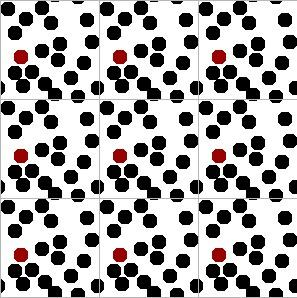

The description above assumes that collisions occur either between atoms or with the wall.  Note that walls would represent a substantial surface to volume ratio for a system of, say, 4 particles that are close together.  In such a system, interactions with the walls would comprise a substantial portion of all the interactions.  In a real fluid, the fraction of molecules interacting with the walls is actually extremely small, so this wall issue is really somewhat artificial.  How can we avoid it? 

If you think about it, the molecules inside our simulation box should be interacting with other molecules, not walls.  We can mimic this effect through “periodic boundary conditions” (PBCs).  All of the forces, collisions, position updates, etc. should be conducted such that molecules on one side of the box interact with molecules on the other side of the box.  An illustration of the PBCs is given below and the dynamic applet on the [SWMD page](http://rheneas.eng.buffalo.edu/etomica/modules/swmd/pbcCubic.html).  Try clicking on the buttons there and reading the relevant text if you have any trouble understanding the figures below.
  

Briefly, you can get the idea by looking carefully at the central square and its magnified image to the right.  Two small slivers of disks are entering through the northern boundary, just as the remaining portions of the same disks are leaving from the southern boundary.  This is easy to do in a computer simulation.  The point is that it eliminates the smooth walls and creates boundaries that look indistinguishable from the rest of the fluid.  You can run into trouble if you make the box too small, but you get reasonable results when the simulation box is more than five times the disk diameter, as it is in this illustration.


The problem that arises in the absence of walls is how to compute the pressure.  The derivation begins with the virial theorem, dating back to Clausius.


$E_K = 1.5NkT = 1.5PV + \left \langle_{pairs} (r_{ij} \bullet F_{ij}) \right \rangle$


Erpenbeck and Wood show that


$\left \langle_{pairs} (r_{ij} \bullet F_{ij}) \right \rangle = - \frac{m}{2t}\sum_{collisions}r_{ij} \bullet \vartriangle u_{ij}$


With the final result that

$Z = 1 + \frac {m}{3tNkT}\sum_{collisions} r_{ij} \bullet \vartriangle u_{ij}$

Qualitatively, this equation says that the forces within a spherical volume element sum up to a pressure over the surface of that volume element.  If we average over all possible sizes of that volume element (ie. $r \in (0, \infty)$ ), then we get the total pressure.  Knowing more about this particular derivation is beyond the scope of this discussion, but you might recognize some similarity to the pressure equation discussed with the macroscopic equations (EL p212).  Note, however, that $\vartriangle u_{ij}$ is a change velocity, whereas $du $ is a change in potential energy. 

$Z = 1-\frac{N_A \rho}{6kT} \int_0^{\infty}\ g(r) \frac{du}{dr} *4 \pi r^3 dr$


Exercise: [Example_4](http://rheneas.eng.buffalo.edu/wiki/DMD:Example_4) 

Homework: [Problem 1.2.5](http://rheneas.eng.buffalo.edu/wiki/DMD:Problems:Level_1), [Problem 1.3.4](http://rheneas.eng.buffalo.edu/wiki/DMD:Problems:Level_1), 


```
<table width="90%">
<td width="50%">

<td width="50%">

</table>
```
