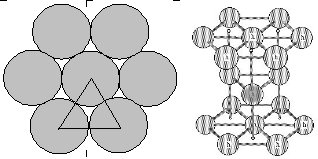

The 2D dynamics are useful for visualizing molecular motion and familiarizing yourself with the meanings of temperature, pressure, and density, but most fluids of interest actually exist in 3D.  How should the extension to 3D alter our analysis or the resulting model equations?  As a matter of fact, there are many similarities.  For example, the extension of the ideal gas model is,


$P = \frac{m}{3L^3}u^2_1 + u^2_2 + ...$


The factor of 3 in the denominator (compared to 2 in 2D and 1 in 1D) shows that it takes longer for the atoms to reach a particular wall when they can wander around in a larger space.  That is not too surprising.  Furthermore, the equations for computing the collision times and velocity changes are identical. Only the extra dimension needs to be included when applying the vector formulas.  A reference frame argument suffices to prove this.  We may assume without loss of generality that particle 1 is lying stationary within one radius of the x-axis and particle 2 is approaching along the x-axis.

The major difference between the 2D and 3D situations refers back to Eq.  and the concept of the close packed density.  How closely can the disks be packed?  We can analyze this by considering an equilateral triangle and asking what fraction of the total space is occupied by disks.  If they completely filled the space, then this “packing fraction” $(\eta)$ would be 100%.  But the Figure below shows that the white spaces between the disks cannot be filled.

```
<table width="100%>
<tr>
<td width="55%" align="left">
By focusing on one triangle, we can get the packing fraction for the overall system.  The area of the triangle is $(\sigma / 2)(3^{1/2}\sigma / 2) = 3^{1/2} \sigma^2/4$.  The area occupied by disks is $3 \pi (\sigma / 2)^2 60/360 = 3 \pi \sigma^2 / 24$ and the ratio is $\eta^{2D}_x = 0.9069$ where the subscript *x* indicates the close packing limit.  This arrangement is called hexagonal packing and is known to provide the most effective packing for disks or spheres.
<td width="45%" align="center">

</tr>
</table>
```


The second figure provides the consistent extension to $3D^2$.  Look closely at the spheres labeled with *h*.  These form a prism that is repeated throughout the material.  The darkened sphere is completely within the prism.  The others are only partially within, analogous to the 60/360 of the disks.  So a similar analysis to that in 2D gives $\eta^{3D}_x = 0.74048^3$.  omparing to the disks, we see that the packing fraction in 3D is less than in 2D, even in the case of most perfect packing.  Note that we can generate a divergence in Z factor by assuming, $Z = 1 + Z_1\eta + z_2\eta^2+ z_3\eta^3) / (1 - \eta / \eta_x)$.