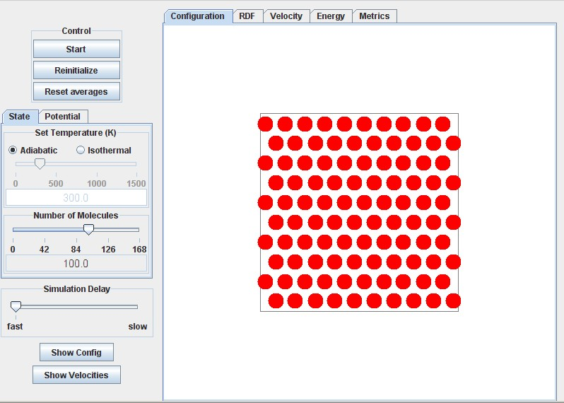
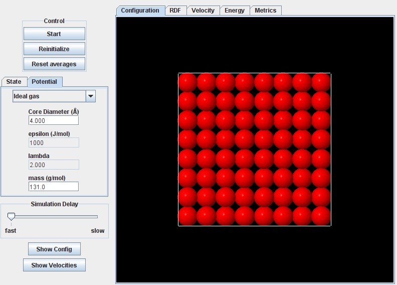

NOTATION
We include a notation section here to facilitate random references. Please check back here if you find a term that has been left undefined. If you still can't find it, send email to jelliott@uakron.edu 

Latin

$a$ = vdW attractive energy parameter as in the vdW EOS(cf. vdW). Roughly, $ a =$ ½ $ \int_0^{\inf} g(x) u(x) 4πx^2 dx $

b = molar volume of a molecule. eg. b=NAπσ³/6 for spheres or b=NAπσ²/4 for disks.

CS = Carnahan-Starling model of 3D hard sphere. ie. (Z-1) = 4η(1-η/2)/(1-η)³

EOS = equation of state 

ESD = Elliott-Suresh-Donohue EOS. For 3D spheres, (ZESD-1)=4η/(1-1.9η) - 9.5Yη/(1+1.7745Yη)

g = radial distribution function (aka. rdf) a correction to the bulk density giving the local density at a reduced distance "x" from a central molecule. 

HS = hard sphere model 

HD = hard disk model 

k = Boltzmann's constant

N = number of molecules 

n = number of moles 

NA = Avogrado's number 

R = gas constant. e.g. R = 8.314J/mol-K = 8.314 MPa-cm3/mol-K.

SW = abbreviation for Square Well potential 

U = internal energy 

vdW = van der Waals, e.g. Zvdw = 1/(1-η) - <i>aρ/RT</i>

x = usually a dimensionless distance r/σ 

Y = exp(βε)-1.0617. Dimensionless temperature in the ESD EOS.

Z = PV/RT = compressibility factor. e.g. Z=1 for ideal gases and Z~0.001 for saturated liquids near their boiling point.

Greek

β = 1/(kT) = a reciprocal temperature with units of energy/molecule 

ε = magnitude of the depth of the square well potential model with units of energy per molecule cf.Figure 1a.
 
η = packing fraction = (volume of molecules)/(total volume). eg. η=bρ=NAρπσ³/6 for spheres or NAρπσ²/4 for disks 

λ = width of the SW model. cf.Figure 1a. 

ρ = density. ie. N/<u>V</u> in 3D or N/<u>A</u> in 2D.
σ = sphere or disk diameter for the SW model. cf.Figure 1a.

 ∞ ε  π  σ λ η β ε ρ ± ≡ ² ³ ≈ ½

The basic layout for this entire module inherits most of its features from the basic layout for the piston-cylinder (p-c) module.  You should refer to that basic layout at:
[http://rheneas.eng.buffalo.edu/wiki/PistonCylinder:Basic_Layout](http://rheneas.eng.buffalo.edu/wiki/PistonCylinder:Basic_Layout)

Once familiar with the features of the p-c module, you can access all the submodules at:
[http://rheneas.eng.buffalo.edu/etomica/modules/swmd/](http://rheneas.eng.buffalo.edu/etomica/modules/swmd/)
or through the links on the "Simulator" section of this wiki.

The layout of the 2D module is illustrated below.  Note the tabs for altering the potential and the watch window.  The potential tab provides the ability to vary the type of potential (ig, HD, SW) and to vary the diameter and square well energy.  Watch window tabs provide the capability to monitor various features as the simulation proceeds.  For example, you might like to monitor the rdf until it is sufficiently smooth for you to draw meaningful conclusions.  The layout is organized to minimize paging up and down while checking points of interest.  The temperature, pressure, energy and density are shown on the Metrics tab.

The 3D layout is extremely similar.  The screenshot below shows the potential tab instead of the state tab.  The 3D module is much slower than the 2D or p-c modules, especially at high density.  Since the volume of the simulation box is fixed, the density is adjusted by adding molecules.  That means more collisions per nanosecond implying more computations. One way to compensate for this is to run the 3D module at low densities while referring to literature or compiled values.  Comparing the literature values at low density can establish the equivalence of the results.  Non-graphical simulators outside of etomica can be used to obtain 3D simulation results with greater expedience.

 ∞ ε  π  σ λ η β ε ρ ± ≡ ² ³ ≈ ½