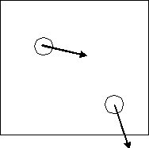

## Collision Time Examples
A 2D fluid is composed of two methane molecules (MW=16, diam=0.36nm) with (x,y) velocities (m/s) given by: (613,-123), (123,-613).  They are positioned in a 5 nm square box at (1,3) and (4,1) respectively (coordinates are also in nm).

(a) Sketch the system and draw an arrow representing the velocity of each particle.  Note that x-components of velocity are both positive. It is large for the first particle.  The y-components are both negative.  The magnitude of the velocities are identical so the same size arrow is used, only the direction is rotated.

(b) Estimate the time (ns) and nature of the first collision.  From the sketch, it is clear that particle 2 will hit the south wall before the two particles can collide.  The particle center will be one radius from the wall at the time of collision.  So we can write 0.18 = 1 - 613*t where dimensions are in nm and ns. (Note: m/s=nm/ns).  Solving gives t = (1-0.18)/613 = 0.00134ns 

(c) Estimate the temperature of this fluid according to the ideal gas model. 

The temperature in 2D is related to PV by 

$nRT = \underline{V}P = L^3*\frac{m}{2L^3} \sum_1^N u_i^2$ 

$u_1^2 = u_2^2 = u_{avg}^2 =$ sqrt(613^2+123^2)=625m/s, and $n = N/N_A$, 
 So $T(2D) = \frac {MW u_{avg}^2}{2R} = 376K$ 

 ∞ ε  π  σ λ η β ε ρ ± ≡ ² ³
