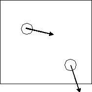

## Ideal Gas Collision Time

1.A 2D fluid is composed of two methane molecules modeled as ideal gas particles with (x,y) velocities (m/s) given by: (613,-123), (123,-613).  They are positioned in a 5 nm square box at (1,3) and (4,1) respectively (coordinates are also in nm).  Estimate the collision time in this case.  From the sketch, it is still clear that particle 2 will hit the south wall before anything else can happen.  The only difference is that the particle has no size (zero diameter) because ideal gas particles are point masses.  So we can write 0.0 = 1 - 613*t.  Solving gives  t = 1/613 = 0.00163ns.

