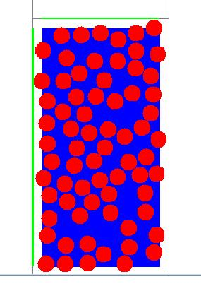

The module has been assessed at three universities in the chemical engineering thermodynamics courses: University of Akron (UA), University of Buffalo (UB), and Michigan State (MSU).  These courses generally start in the spring of the sophomore year.  The assessment takes the form of survey questions at all three schools and ConcepTesting at UA.  The DmdConcepts.ppt file can be downloaded at www.egr.msu.edu/~lira/thermtxt.htm  

## ConcepTesting 

The (#%) numbers in parentheses refer to the percentage of students answering correctly.  A few sample questions are listed here.  Refer to DmdConcepts.ppt for a more complete list.

A disk is initially at the position (0.2,0.2)nm in a box that is 5nm on a side with its lower left corner at the origin in Cartesian coordinates.  The disk is 0.4 nm in diameter.  The velocity of the disk is (543,456)m/s.  Compute the time (ns) when the disk collides with the east wall. (63%)
A. 0.0101   B. 0.0085   C. 0.0110   D. 0.0088

The picture below represents hard spheres colliding in a planar box (like an air hockey table).  Which represents the area of the box that should be used to compute density? (39%)
A. The blue area    B. The area inside the grey/green lines    C. none of the above 

## Molecular Simulation Impressions Survey (Agr+Dis+Neutral=100%, Neutral not shown) 

UB07....................................................................................Agr.....Dis

I had difficulty operating the computer simulation.................17%......67%

Given information sufficed to answer questions..................89........3  

Simulation helped me visualize molecular motion...................39.......33 

Simulations are a good way to learn new concepts.............69........6  

Based on this, I would do more simulations..........................39.......28 

Simulation provided new insights into engineering................47.......22 

Simulation enhanced learning in other courses.....................35.......21 

Time spent was worthwhile..................................................19.......53 

UA08....................................................................................Agr.....Dis

I had difficulty operating the computer simulation..................6%......76%

Given information sufficed to answer questions..................71........6  

Simulation helped me visualize molecular motion...................82.......12 

Simulations are a good way to learn new concepts.............82........0  

Based on this, I would do more simulations..........................28.......28 

Simulation provided new insights into engineering...............56.......28 

Simulation enhanced learning in other courses....................22.......36 

Time spent on the 2D module was worthwhile....................35.......18 

Time spent on the 3D module was worthwhile*.....................0.......67 

I ran and understood the Java 2d DMD.................................89.......11
*NOTE: The exercises in the current version have been revised to refer to 3D results at high densities, instead of requiring simulation, in the interest of reducing time requirements.

MSU08....................................................................................Agr.....Dis

Detail for coursepack on MD was about right......................85%.....12%

Given information sufficed to answer questions..................27......71

Background sufficed to program DMD in MatLab..................37......63

I ran and understood the command line 3d DMD...................62......33

I ran and understood the Java 2d DMD.................................62......31

Time for this assignment was like others..............................65......23
