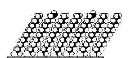
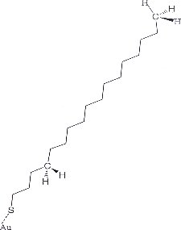
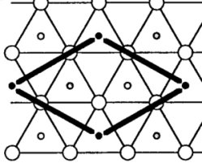

Molecular self-assembled monolayers are films made up of long chain organic molecules, essentially alkanes, which spontaneously form on certain solid substrates by immersing the substrate in a solution of an active surfactant in an organic solvent. The organic monolayers formed through self-assembly are usually closely packed and, therefore, have a highly ordered structure [1].

The self-assembled monolayer in question in this module consists of sulfur-terminated n-alkanes, namely, $CH_3(CH_2)_{n-1}SH$, where n = 15. The head group, viz., SH, is chemisorbed onto a gilded solid surface, the alkane chain consists of methylene, $-CH_2-$, groups, while the free surface (tail group) consists of a methyl group, $-CH_3$.

The simplest $CH_3(CH_2)_{n-1}$ (n = 15)/gold(111) SAM consists of a commensurate $(\sqrt{3}\times \sqrt{3})R30^{\circ}$ overlayer structure with one alkanethiol chain in the two-dimensional unit cell, according to electron diffraction results [2].

large circles: gold atoms; small circles: locations of SH groups

1.Ulman, A. (1996). “Formation and Structure of Self-Assembled Monolayers,” Chemical Reviews 96, 1533-1554. 
1.Strong, L. and Whitesides, G.M. (1988), “Structures of Self-Assembled Monolayer Films of Organosulfur Compounds Adsorbed on Gold Single-Crystals-Electron-Diffraction Studies,” Langmuir 4, 546-558.