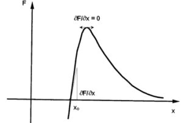
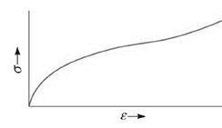
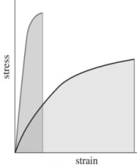

Like many other properties of materials, the mechanical properties begin to strikingly deviate from bulk scaling laws when the characteristic length, i.e., surface area over volume, becomes small [1]. Under this condition surface forces (short-range forces) become predominant over body forces such as gravity [2]. All forces between atoms and molecules are essentially electrostatic in nature as established from the theory of quantum mechanics. Intermolecular forces consist of two components: an attractive force to hold atoms/molecules together, and a repulsive force at short atomic/intermolecular distances to prevent the nuclei from overlapping. The attractive force can be the result of charge transfer interactions as in the case of chemical bonds. The repulsive force arises from the Pauli exclusion principle. The sum of the attractive and repulsive forces yields the total force.

A wealth of information on the mechanical properties of materials can be extracted from the curve relating the total force responsible for keeping atoms together to the distance between the atoms. Stress, $\sigma$, is defined as the applied load, F, per unit area, A, to applied load. Strain, $\varepsilon$, as defined as the ratio of the difference in separation distance over the distance at equilibrium, $x_0$.  Properties that can be determined from the proposed molecular counterpart of the stress-strain 

relationship include: The elastic constant (Young’s modulus), E, of the system, which is related to the slope at equilibrium, $(dF/dx)_{x=x_0}$ and the toughness of the material, which is the area under the curve (stress-strain curve) up to the point of failure.

Since the slope of the force-displacement curve at equilibrium distance is a measure of the force required to displace atoms from their equilibrium position, the Young’s modulus (or stiffness), E, expresses the resistance of the material to atomic separation. It is also the linear mechanical response of the material. Toughness is a combination of both linear and nonlinear mechanical response (plastic, buckling, and failure) of a material.

1.Vinci, R.P. and Baker, S.P. (2002), “Mechanical Properties in Small Dimensions,” MRS Bulletin 1, 12-13.
1.Kendall, K. (1994), “Adhesion: Molecules and Mechanics,” Science 263, 1720-1725.