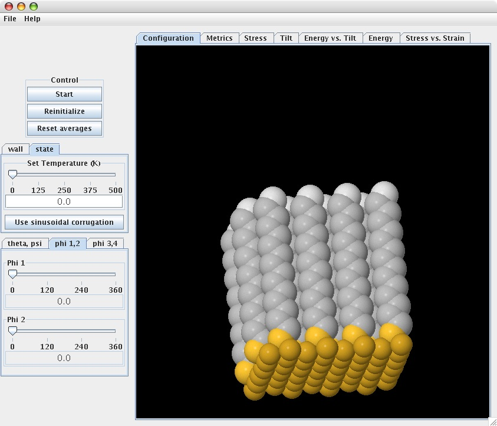
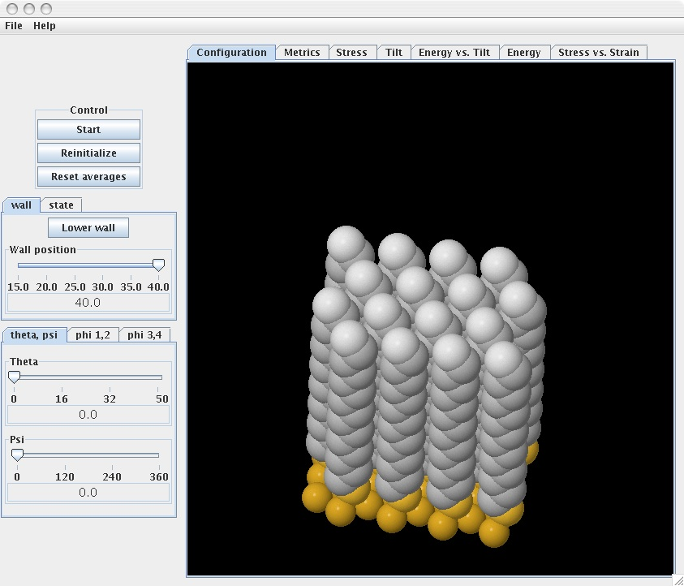

The simulation is controlled through the control panel on the left side of the display area of the window. A display of the SAM system is accessible via the “Configuration” tab. On the display an assembly of alkanethiol molecules adsorbed on a gold substrate (gold-colored spheres) is shown.  The chain consists of SH group (yellow sphere), $-CH_2-$ groups (gray spheres), and $-CH_3$ group (white sphere). The control panel consists of tabs and sliders that allow the user to easily interact with the simulation parameters. The tabs located above the simulation display mainly allow for the graphical representation of output data. 

At the top of the control panel are three buttons: “Start” to start and stop the simulation run, “Reinitialize” to restart the simulation run from the initial state of the system, and “Reset” to reset averages by discarding any previous contributions. 

The middle section of the control panel consists of two tabs: “State” tab that allows the user to set the temperature (in K) of the system, and “Wall” tab. The sub-tab, “Use Sinusoidal Corrugation,” of the state tab permits to choose between either a harmonic or a sinusoidal form of the surface corrugation potential.

The wall tab is used to simulate compression of the SAM system by a wall. The tab permits to lower or raise the wall - the unit of wall position is given in Ångström. At the bottom of the control panel are three tabs, each containing two sliders, to allow the user to set the values of the rotational parameters of the initial SAM structure. The “Theta, Psi” tab sliders correspond to chain orientation (tilt and azimuth) angles, while the sliders of the “Phi 1,2” and “Phi 3,4” tabs correspond to the rotation angle of the chains about their axes.  It is through the phi tabs that the number of chains (1, 2 or 4) per unit cell can be defined. 

 

Just above the main display are seven tabs, including the “Configuration” tab. The latter helps to visually follow structural developments in the SAM/gold system during the simulation. The “Metric” tab displays some of the parameters of the simulation algorithm, namely, simulation time, temperature, load exerted by the wall, and tilt angle. The “Stress”, “Tilt”, and “Energy” tabs display plots illustrating the time dependence of applied stress, chain tilt angle and SAM energy, respectively. The “Energy vs. Tilt” tab allows the user to access the plot showing the evolution of the SAM energy with the tilt angle. The “Stress vs. Strain” tab allows the user to access the plot illustrating the dependence of applied stress on strain.