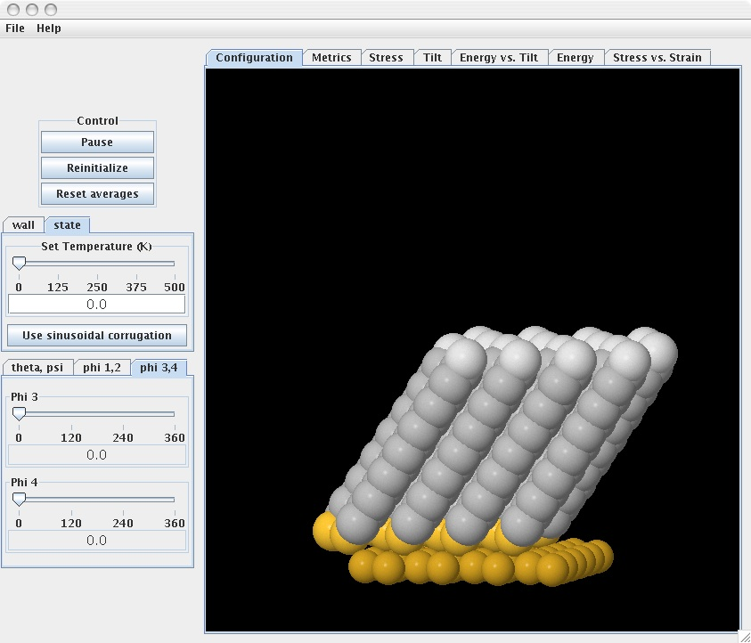
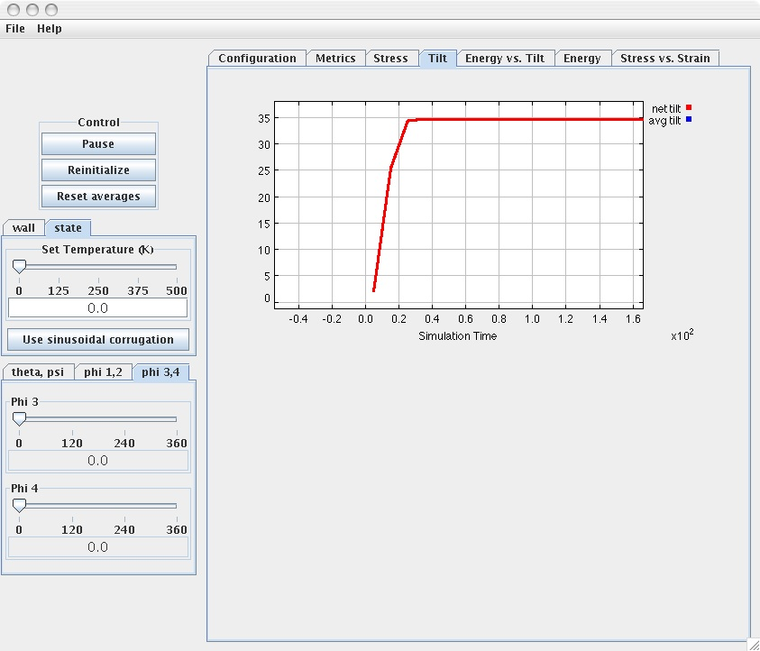

## Stress-free SAM at equilibrium 

Experiments during which the SAM system is subjected to compression, in order to generate stress-strain relationships, can only be carried out after the SAM system has reached equilibrium. 

To run this example, load the simulation (if the simulation has been already loaded push the “Reinitialize” tab) and set the values of the following parameters to:

* Temperature = 0 K (via the “State” tab)
* Theta = 0, Psi = 0 (via the “Theta, Psi” tab)
* Phi 1 = 0, Phi 2 = 0 (via the “Phi 1,2” tab)
* Phi 1 = 0, Phi 2 = 0 (via the “Phi 3,4” tab)

The last four parameters (rotational) indicate that there is one chain per unit cell. This is the case whenever these parameters are set to the same value. 

Push the “start” tab. Observe the changes in the tilt angles as well in the orientation angles of the chains. After some time, the equilibrium structure of the SAM system is reached as displayed. 
 

The "Energy vs. Tilt" tab shows the changes in the total energy of the SAM system as a function of tilt angle. Energy dcreases with tilt until it reaches a minimum value (equilibrium). Push the “Tilt” and “Energy” plot tabs to see the time evolution of the tilt angle and energy of the SAM system. You’ll notice from the tilt vs. time plot below that the equilibrium structure corresponds to a tilt angle of about $34^o$ (this is in good agreement with experimental observations). 

