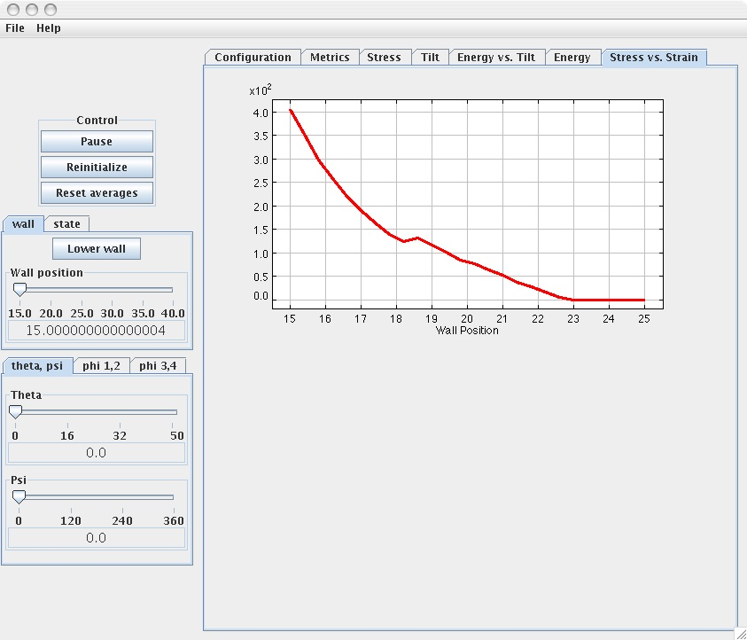

## SAM under stress 

In this experiment, the SAM system is subjected to compression in order to generate stress-strain relationship. This can only be achieved after the stress-free SAM system has reached equilibrium (refer to Example 1). Load the simulation (if the simulation has been already loaded push the “Reinitialize” tab) and set the values of the following parameters to:

*Temperature = 0 K (via the “State” tab)
*Theta = 0, Psi = 0 (via the “Theta, Psi” tab)
*Phi 1 = 0, Phi 2 = 0 (via the “Phi 1,2” tab)
*Phi 1 = 0, Phi 2 = 0 (via the “Phi 3,4” tab)

The last four parameters (rotational) indicate that there is one chain per unit cell. This is the case whenever these parameters are set to the same value. 

Push the “start” tab. Observe the changes in the tilt angles as well in the orientation angles of the chains. After some time, the equilibrium structure of the SAM system is reached and corresponds to a tilt angle of about $ 34^o $ (in good agreement with experimental observations) by pushing the “Tilt” tab. 

Next, push the “Wall” tab then the sub-tab “Lower Wall.” The wall will progressively move downward toward the SAM system. It is also possible to lower the wall manually via the “Wall Position” slider in order to start the loading experiment relatively quickly. In this case the wall should be lowered just above the free surface of the SAM system, then the wall is lowered progressively by pushing the “Lower Wall” tab anew.

 

After the wall has reached a minimum (preset to 15 Å) position, the loading experiment stops. Push the “Stress vs. Strain” tab. A plot showing the variation of stress as a function of strain (wall position) is displayed.

