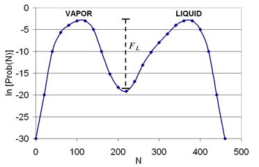

Vapor-liquid interfaces are encountered thoughout all aspects of nature, and in particular,
are important to atmospheric aerosol formation and surface chemistry, self-assembly processes,
coatings, separations, and many other practical applications.  The interfacial tension is one
of the fundamental properties used to characterize the border between two contacting phases,
and molecular simulations have demonstrated recent success in accurately predicting the value of
this property.  Also, since interfacial regions are typically defined by units of only a few nanometers,
this length scale can be easily accommodated in a molecular simulation.  Of course, experiments
can also be used to directly measure interfacial properties, such as the interfacial tension. 
However, there can be limitations, depending upon the system being studied.  For instance, there
is no direct experimental method available to measure the interfacial tensions of solid-liquid or
solid-vapor interfaces, due to the deformity limitations of solids [[1]](Interfacial_tension/References#ref_bahadur).

From a practical perspective, the interfacial tension represents a measurement of the cohesive
energy present at an interface.  Unlike molecules in a bulk fluid, molecules at an interface
experience an inbalance of forces, and the net effect is the presence of an excess free energy
at the surface, which gives rise to the interfacial tension.

In simulation, two general routes have been used to quantify the interfacial tension of a
system: explicit interface simulations and interface-free simulations.

## Explicit interface simulations (implemented here)

In the explicit interface method, either molecular dynamics or Monte Carlo simulations
can be used to explicitly model the interface between two coexisting phases within a single
simulation cell.  This is the simulation approach used here.  Once the two phases have
equilibrated and the interface region is well-established, the interfacial tension ($\gamma$) can be estimated by calculating the average
difference between the normal and transverse components of the pressure tensor (P) over the
length of the simulation cell, as shown in Eq. (1).  The pressure should be symmetric in
the bulk fluid, so that there should be contributions to this value only within the interfacial regions.

$\gamma = \frac{L_x}{2} \left [ <P_{xx}> - 0.5(<P_{yy}> + <P_{zz}>) \right ]$ &nbsp; &nbsp; &nbsp; &nbsp; (Equation 1)

In the above equation, $L_x$ is the simulation box length in the $x$-direction (normal to the interface), and the factor of 1/2 accounts for the presence of two coexisting interfaces in the system.

## Interface-free simulations

In the explicit interface approach (mentioned above), there can be some practical simulation
challenges.  For instance, long simulation times may be required to stabilize the vapor-liquid
interface, and the final results may be sensitive to the system size and the treatment of long-range
interactions.  In order to address some of these shortcomings, indirect approaches have been
developed, which rely on the combination of transition-matrix Monte Carlo simulations and
finite-size scaling [[2]](Interfacial_tension/References#ref_singh1),[[3]](Interfacial_tension/References#ref_potoff),[[4]](Interfacial_tension/References#ref_singh2).  We only briefly mention this approach here,
with the details given elsewhere, since only the explicit interface approach is implemented
in the Interfacial Tension module.  In the indirect approach, the simulations are designed
to directly calculate the relative free energy along an order parameter path that connects the
two phases of interest, and the free energy can be used to directly calculate the interfacial
tension (see Eq. (2), below).  Also, the figure below provides a qualitative description of this approach.
The individual simulations are performed on homogeneous systems, so that
standard long-range corrections can be applied, simulation times can be reduced, and accuracy can
be improved, especially near the critical point.

$\gamma = \frac{F_L}{2L^2}$ &nbsp; &nbsp; &nbsp; &nbsp; (Equation 2)

In the above equation, $L$ is the box length of the simulation cell and $F_L$
represents the height of the free energy barrier separating the coexisting phases.  Obviously, as the free
energy barrier approaches zero, the distinction between the two phases disappears, and the value of the interfacial
tension becomes zero.  The temperature at which this occurs is known as the critical temperature.

**(Above)** Probability of observing N particles [Prob(N)] in a simulation box at a fixed temperature, volume, and chemical potential. This data is representative of a grand-canonical Monte Carlo simulation.  The symbol $F_L$ is the free energy barrier between the vapor and liquid phases.