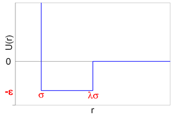

In these simulations, an intermolecular potential is necessary for describing the interactions among the particles.  A number of different potentials are available for modeling fluid phase behavior, such as the Lennard-Jones potential, the Buckingham potential, etc.  Here, in order to maximize simulation speed, a square-well (SW) intermolecular potential is used.  This model includes both repulsive and short-range attractive interactions, and it is the simplest intermolecular potential that is capable of representing liquid properties.  The form of this potential is as follows:

$u(r)= \begin{cases} \begin{align} \infty \text{ if r} \leq \sigma \\ -\epsilon \text{ if r} < \lambda\sigma \\ 0 \text{ if r} \geq \lambda\sigma \end{align} \end{cases} $ &nbsp;&nbsp;&nbsp;&nbsp;&nbsp;&nbsp;&nbsp;(Equation 3)

Graphically, the SW potential can be representated as:

According to Equation 3, the fluid behavior is dictated by the choice of the model parameters $\sigma$, $\lambda$, and $\epsilon$.  In the Interfacial Tension module, these parameters are fixed, and the results from the simulations are reported in dimensionless units (with respect to these parameters).  For instance, the temperature is reported in units of $\epsilon$.  While the parameters of the fluid are fixed, the parameters of the surfactant molecules are adjustable.  The surfactant molecules are modeled as diatomic particles, composed of a "head" piece and a "tail" piece.  In the module, the $\epsilon$ of the head can be increased or decreased (relative to the $\epsilon$ of the surrounding fluid), and the tail diameter can be increased or decreased (relative to the diameter of the surrounding fluid molecules).  This flexibility allows the user to explore a wide range of surfactant behavior, as well as the resulting effects on the interfacial properties.

Since the particles in the simulation interact via a SW potential, the system cannot be simulated with traditional continuous dynamics methods.  For instance, a direct calculation of the force at a distance of r = $\sigma$ or $\lambda\sigma$ yields a value of $\infty$ (and zero everywhere else).  In this case, discontinuous molecular dynamics methods (DMD) are necessary for propagating the particle motions through time.  For background information and additional details of this approach, see the [DMD Module](http://rheneas.eng.buffalo.edu/wiki/DMD).