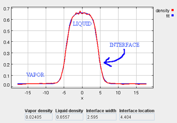
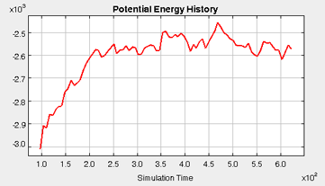
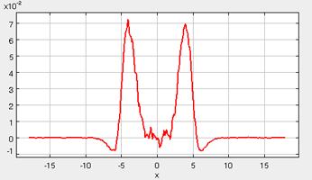
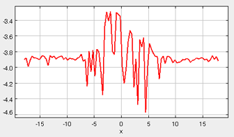

During the course of the simulation, several different system properties are calculated (as a function of the x-dimension).  In order to generate the x-dimension profile of these quantities, the simulation cell is subdivided into small bins, and the local value of each quantity is reported as a function of (x) in the corresponding "profile" graphs.

* Density
* Energy (potential energy)
* Orientation (surfactants)
* Virial
* Interfacial Tension
* Chemical potential
  
## Density 

The density profile provides a good representation of the phase behavior of the system.  In the first stage of the simulation, when the molecules are at a liquid-phase density in the cubic simulation box, the density profile is relatively consistent along the x-coordinate.  However, once the box is expanded during the second stage (and the vapor phase is allowed to form), the density profile can be examined to clearly identify the vapor phase, liquid phase, and interface region (see figure below).  Also, when surfactants are present, their preferred locations can be clearly identified.  In order to extract quantitative information from the density profile data, the local density bins are dynamically fit to an empirical equation:

$\rho(x)=\frac{1}{2}(\rho_L + \rho_V)-\frac{1}{2}(\rho_L-\rho_V)\text{tanh}\left[\frac{2(x-x_0)}{d}\right]$ &nbsp;&nbsp;&nbsp;&nbsp; (Equation 4)

$\rho(x)$ = density profile as a function of x position

$\rho_L$ = liquid phase density

$\rho_V$ = vapor phase density

$x_0$ = position of the Gibbs dividing surface

$d$ = width of the interface

## Energy 
The total potential energy of the system is dynamically plotted as a function of the simulation time, according to the equation below.  This plot gives a good initial indication of the equilibration status of the system.  Although there will always be fluctions in the plot, once equilibration is reached, the fluctionations should be centered around the steady-state potential energy (i.e., there should be no net drift in the potential energy with respect to time). 

$u_{\text{total}}=\displaystyle\sum_{i=1}^{N-1}\displaystyle\sum_{j=i+1}^Nu(r)$ &nbsp;&nbsp;&nbsp;&nbsp; (Equation 5)

$i$ and $j$ = particle numbers

$N$ = total number of particles

## Orientation 
When surfactants are added to the simulation, it is important to be able to identify and characterize not only the locations of the surfactant molecules (with the density plot), but also the orientations of the surfactant molecules.  The orientation plot represents the orientation of the surfactant molecules (only when surfactant molecules are present), and the average orientation of the surfactants are reported as $cos(theta)$, where theta is the orientation of the molecule with respect to the x-axis.  Positive values of $cos(theta)$ indicate that the "tail" side prefers to be oriented in the +$x$ direction.  In the figure below, taken from a representative simulation, the tail group of the surfactants prefers to be located on the vapor-phase side of the interfaces.  Whereas, in the bulk liquid and vapor regions, the average orientation of the surfactants is more evenly distributed.

## Virial 
The virial tensor is indicative of the molecular forces present in a system, and it can be used to identify any asymmetry with respect to those forces.  Often, the virial tensor ($\Pi$) is part of the pressure calculation performed during a molecular simulation, as it captures the deviation from ideal gas behavior.  For instance, the instantaneous pressure of a system can be calculated as:

$\displaystyle  P=\rho k_B T + \Pi/V = P^{ideal}+P^{excess}$ &nbsp; &nbsp; &nbsp; &nbsp; &nbsp; (Equation 6)

$P$ = total pressure

$P^{ideal}$ = ideal gas contribution to the pressure

$P^{excess}$ = non-ideal contribution to the pressure

$k_B$ = Boltzmann's constant

$T$ = system temperature

$V$ = system volume

The diagonal components of the virial tensor are defined below, where the alpha index refers to the x, y, or z dimension, and $f_{ij}$ and $r_{ij}$ represent the force and the distance between sites $i$ and $j$, repsectively.  

$\Pi_{\alpha \alpha} = \displaystyle\sum_{i=1}^{N-1} \displaystyle\sum_{j=i+1}^N r_{ij}^{\alpha}f_{ij}^{\alpha}$ &nbsp; &nbsp; &nbsp; &nbsp; &nbsp; (Equation 7)

The three diagonal components of the virial tensor will typically all be equal in a bulk liquid or gas phase.  Additionally, in the gas phase the magnitude of these components should be small, since the interactions among the gas phase molecules should be minimal.  These general characteristics are seen in the figure shown below (taken from one of the simulation runs).  The vapor phase exists in the left- and right-hand-sides of the simulation box, where the virial components are all approximately zero.  In the center of the box, the liquid phase exists, and this phase is accompanied by much larger (negative) values of the virial components.  Although there is some scatter in the data, the three component of the virial are equivalent in the center of the box (representative of the bulk liquid), but near the vapor-liquid interfaces (around +/- 4x), there is a distinctive and characteristic deviation among the virial components.  The imbalance among the x, y, and z components of the virial tensor gives rise to the interfacial tension. 

## Interfacial Tension 
One of the primary quantities of interest in these simulations is the interfacial tension.  The interfacial tension can be calculated in these simulations according to Equation 1 ([Interfacial_tension/Theory](Interfacial_tension/Theory)).  In this equation (repeated below), the interfacial tension is written as a difference of the diagonal components of the pressure tensor (Equation 8).

$\gamma = \frac{L_x}{2} \left [ <P_{xx}> - 0.5(<P_{yy}> + <P_{zz}>) \right ]$, where

$P_{\alpha \alpha} = \rho k_B T + \frac{\Pi_{\alpha \alpha}}{V} = \rho k_B T + \frac{1}{V} \displaystyle\sum_{i=1}^{N-1} \displaystyle\sum_{j=i+1}^N r_{ij}^{\alpha}f_{ij}^{\alpha}$ &nbsp; &nbsp; &nbsp; &nbsp; &nbsp; (Equation 8)

In the figure below (taken from a representative simulation), the interfacial tension is plotted as a function of the x-coordinate, so that the interfacial tension can be identified along the length of the simulation cell (within the gas, liquid, and interface region).  In the figure, it is apparent that the gas-phase contribution (corresponding to the far right- and left-hand-sides of the box) to the interfacial tension is negligible.  Likewise, the center of the simulation box, corresponding to the bulk liquid phase, contributes very little to the interfacial tension.  However, in the interfacial regions, there is a significant spike in the interfacial tension plot.  In fact, the total interfacial tension for the system can be calculated by numerically integrating this interfacial tension profile, and dividing by a factor of two (since two identical interfaces are present in the simulation box).  A reasonable criteria for confirming the equilibration of these simulations is by ensuring that the interfacial tension profile is "relatively smooth" and symmetric.

## Chemical Potential 
The chemical potential profile of the box gives an indication of the equilibration and phase stability of the system.  At equilibrium, it is necessary that the chemical potential ($\mu$) of each phase must be equal:

$\mu_{\text{liquid}} = \displaystyle \mu_{\text{gas}}$ &nbsp; &nbsp; &nbsp; &nbsp; &nbsp; (Equation 9)

In order to calculate the chemical potential of the fluid, Widom's test particle insertion method is used [[5]](Interfacial_tension/References#ref_widom).  This approach separates the ideal ($\mu^{\text{ideal}}$) and excess ($\mu^{\text{excess}}$) chemical potential into two terms (Equation 10).  During the course of the simulation, periodic sampling is performed to evaluate the excess chemical potential term (Equation 11), where the brackets in Equation 11 denote an ensemble average.  The sampling involves performing "ghost" insertions into the fluid, and evaluating the change in potential energy ($dU_{\text{ghost}}$) associated with these trial moves.  These ghost insertions are performed at random locations in the fluid, but since these are ghost insertions, these moves are never accepted.  Hence, the total number of particles in the simulations always remains fixed.  

$\mu^{\text{excess}}= \displaystyle \mu - \mu^{\text{ideal}} $ &nbsp; &nbsp; &nbsp; &nbsp; &nbsp; (Equation 10)

$\mu^{\text{excess}}=-k_B T \text{ln} \langle \text{exp} \left( \frac{-dU_{\text{ghost}}}{k_BT} \right) \rangle $ &nbsp; &nbsp; &nbsp; &nbsp; &nbsp; (Equation 11)

In the figure below (taken from a representative simulation), the chemical potential profile is very smooth throughout the gas phase, while the liquid phase profile shows large fluctuations.  Most importantly however, the *average* chemical potential in the liquid phase is essentially equal to the *average* chemical potential in the gas phase.  The reason for the large fluctuations in the liquid phase value is due to the calculation procedure.  As a general rule, since trial particle insertions are used to evaluate the excess chemical potential, more thorough sampling will improve the statistics of the calculated values.  In the gas phase, it is relatively easy to perform the sampling, since at low density, the majority of the trial insertions do not overlap with neighboring particles (which would lead to an infinite $dU_{\text{ghost}}$ and contribute little to the evaluation of Equation 11).  In contrast, the liquid phase has a high density, which leads to a significant number of overlaps during the sampling procedure, and this limits the quality of the data sampling.

