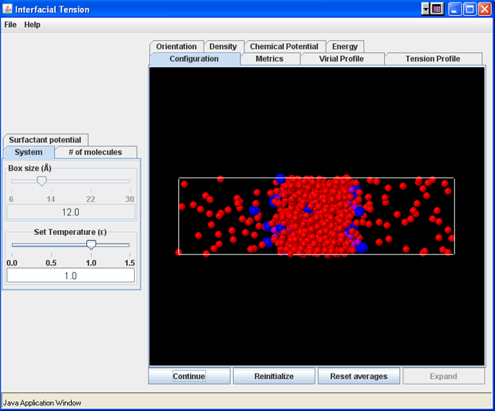
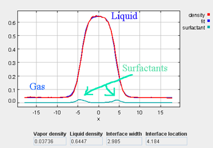
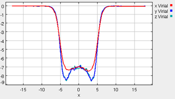

**Simulation Example WITH Surfactants**

Re-initialize the simulation. If a simulation has not been run since the application has been started, the
simulation will already be initialized and the first button in the Control panel will be labeled “Start”. If
the simulation has been previously started, even if it is currently paused, push the Reinitialize button. The
“Continue” button will change to “Start” again upon re–initialization.

Set the simulation parameters to :

* Temperature ($\epsilon$) = 1.0
* Box size = 12.0
* Number of atoms = 643
* Number of surfactants = 20.0
* Surfactant head epsilon = 3.0
* Surfactant tail diameter = 1.4

Start the simulation by pushing the Start button. The button will change its label to “Pause” which can be
used to pause and continue the simulation at any given time.

As the simulation proceeds, observe the atoms diffusing within the cubic simulation
box at a liquid-like density.  The density profile can be monitored (which should have an average value of around
0.54), as well as the potential energy and the other simulation metrics.  Once the simulation
has been allowed to run for approximately 100 ps, the liquid phase should be fairly well stabilized.  On a 
modern PC, this should take approximately 1 minute.  At this point, the fluid will *not* necessarily be
fully equilibrated, but it should be stable enough to proceed to the next step, which begins the two-phase simulation.

At this point, the "Expand" button can be pressed, which increases the x-dimension of the 
simulation box by a scale-factor of 3.  When this button is pressed, the surfactant molecules will be inserted into the
gas phase of the simulation box, according to the pre-specified number of surfactants.  Once this point
has been reached, it is not possible to alter the number of surfactant molecules in the simulation.  The surfactant
parameters can still be modified, if desired, but the simlation must be reinitialized if the number of surfactants
needs to be changed.  As the simulation progresses, you can observe under the Configuration tab that the atoms
from the liquid-like region begin evaporating into the newly-created void spaces in the expanded simulation box.  Simultaneously, the surfactant molecules begin to be distributed throughout the simulation cell (they tend to accumulate 
at the vapor-liquid interface).
It takes approximately 300 ps of simulation time in order to stabilize the two-phase system with the surfactants.  Once this
point has been reached (a total simulation time of 400 ps or more), the "Reset Averages" button can be pushed,
which will reset the plots and the data collection for the averages will be reinitialized.  The progress of the
simulation will be unaffected by resetting the averages.

The “Error” printed for each property in the Metrics tab is the statistical error of the running average; it does not necessarily indicate if the results are converged. For example, there could be a steady drift in the surface tension despite
small magnitudes of the Interfacial Tension Error listed in the Metrics tab.  Below are some screen shots
of what a simulation typically looks like after roughly 2000 ps (following the equilibration period), as well as representative data profile plots:

*surfactant head = purple

*surfactant tail = blue

*Density Tab (with surfactants)

*Orientation (of the surfactants)

*Virial Profile

*Tension Profile

It takes approximately 1500 ps (roughly 6 to 8 min on a modern PC) for the most drastic
variations in the properties to disappear.  Use more steps if necessary to diminish statistical errors in the computed properties and
to make sure there are no systematic drifts in the calculated properties (this is easily revealed by the various
plots). You will find that the vapor and the liquid density converge rather quickly (found under the Density tab)
at temperatures well below the critical point, but that the virial, interfacial tension, orientation, and chemical potential profiles may require more steps to converge.  One of the key features to examine is the symmetry of the various profile plots.
Although there will still be fluctuations, they all should essentially become symmetrical as the simulation converges.  Once converged, the statistics from the simulation can be documented, such as the surface tension, the liquid and gas phase densities, and the potential energy.  These results are unique to the parameters specified for a given simulation, including the thermodynamic conditions and the intermolecular parameters.