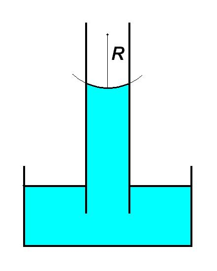
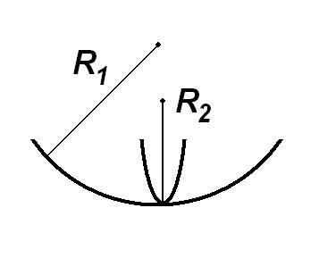
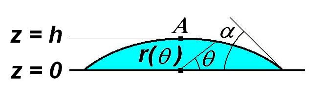
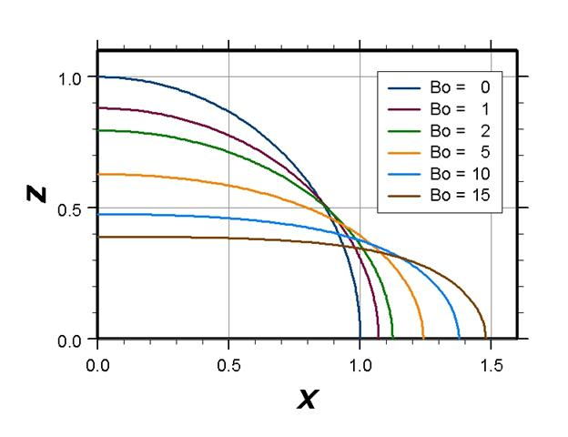
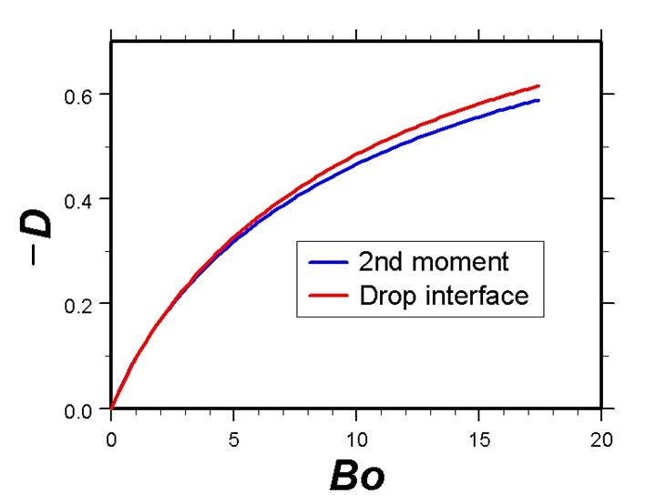
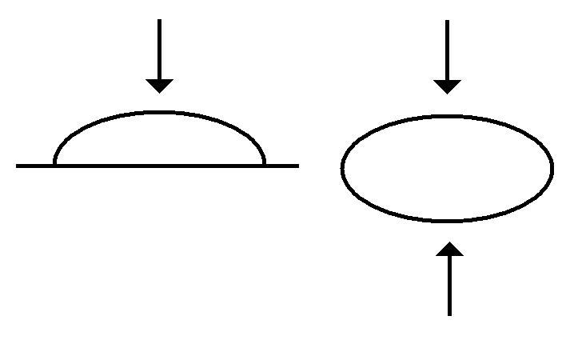

=Capillarity Theory at the Continuum Scale=

The continuum manifestation of interfacial tension is the Young-Laplace equation, whereby the pressure drop across a curved interface is given by

$
(1) \;\;\;\;\;\;\;\;\;\;
\Delta P \;\; = \;\; 2 \gamma H \;\; = \;\; 2 \gamma 
\left[ \frac{1}{2} \left( \frac{1}{R_{1}} \, + \, 
\frac{1}{R_{2}} \right) \right]
$

The pressure is lower on the convex side of the interface, which explains the phenomenon of capillary rise.

Here $H$ is the mean curvature of the interface, and it is obtained from the two principal radii of curvature $R_{1}$  and  $R_{2}$, which are taken at right angles to each other in any convenient local coordinate system.

When the interface is spherical (as in the capillary rise example), then $H = 1/R$  and equation (1) reduces to the more familiar form

$
(2) \;\;\;\;\;\;\;\;\;\;
\Delta P \;\; = \;\; \frac{2 \gamma}{R}
$

Note that the radius $R$ of the spherical interface depends on the contact angle of the air-liquid interface with the capillary wall. Only for zero contact angle (i.e., perfect wetting) is $R$ equal to the capillary radius.

Now let’s consider an axisymmetric, sessile drop: a drop of density $\rho_{\rm d}$ sitting on horizontal a solid surface and immersed in a surrounding fluid of lower density $\rho_{\rm s}$. 

The outline of the drop in a meridian plane is specified in polar coordinates $r(\theta)$ with $0 < \theta < \pi / 2$. Leaving aside a rather lengthy mathematical derivation, the local mean curvature can be expressed as

$
(3) \;\;\;\;\;\;\;\;\;\;
H(\theta) \;\; = \;\; 
\frac{2 r^{\prime}(\theta)^{2} \, + \,
      r(\theta)^{2} \, - \,
      r(\theta) r^{\prime \prime}(\theta)}
     {2 [ r(\theta)^{2} \, + \, r^{\prime}(\theta)^{2} ]^{3/2}}
\; + \; 
\frac{r^{\prime}(\theta) \sin(\theta) \, + \, r(\theta) \cos\theta}
     {2 r(\theta) \cos\theta 
      [ r(\theta)^{2} \, + \, r^{\prime}(\theta)^{2} ]^{1/2}}
$

At the apex of the drop (point A at altitude $h$ in the drawing abobve), the local mean curvature determines a baseline interfacial pressure difference $(\Delta P)_{\rm A} = (P_{\rm s} - P_{\rm d})_{\rm A} = 2 \gamma H_{\rm A}$. At any point below the apex ($0 < z < h$) we can calculate the hydrostatic pressure in each fluid according to its density, whereby

$
(4) \;\;\;\;\;\;\;\;\;\;
\Delta P \;\; = \;\; 
(\Delta P)_{\rm A} \; + \; 
(\rho_{\rm d} - \rho_{\rm s}) g (h - z)
\;\; = \;\; 
2 \gamma H_{\rm A} \; + \; 
(\Delta \rho) g (h - z)
$

Note that the pressure difference is biggest at the bottom, which implies the same trend for the mean curvature. Combining equations (1) and (4), and expressing altitude   in polar coordinates, we obtain an equation for the interfacial profile

$
(5) \;\;\;\;\;\;\;\;\;\;
H(\theta) \;\; = \;\; 
H_{\rm A} \, + \, \frac{1}{2}
\left[ \frac{(\Delta \rho) g}{\gamma} \right]
\Big[h - r(\theta) \sin\theta\Big] 
$

Because $H(\theta)$ is given in terms of $r(\theta)$ and its derivatives by equation (3), this is actually a second-order ODE for the interfacial profile. 

##Dimensionless ODE for the drop profile

For reasons that will become evident later, we shall make distances dimensionless with respect to the equivalent radius $a$  of a spherical drop that has twice the volume $V$ of the sessile drop in question,

$
(6) \;\;\;\;\;\;\;\;\;\;
2 V \;\; = \;\; \frac{4}{3} \pi a^{3} 
\;\;\;\;\;\;\;\;\;\; \Rightarrow \;\;\;\;\;\;\;\;\;\;
a \;\; = \;\; \left( \frac{3 V}{2 \pi} \right)^{1/3}
$

Denote dimensionless variables with an overhat (^). 

$
(7) \;\;\;\;\;\;\;\;\;\;
\hat{r}(\theta) \;\; = \;\; a^{-1} r(\theta),
\;\;\;\;\;\;\;\;\;\;
\hat{H}(\theta) \;\; = \;\; a H(\theta)
\;\;\;\;\;\;\;\;\;\;
\hat{V} \;\; = \;\; a^{-3} V
$

Thus equation (5) adopts the dimensionless form

$
(8) \;\;\;\;\;\;\;\;\;\;
\hat{H}(\theta) \;\; = \;\; \hat{H}_{\rm A} \, + \, \frac{1}{2}
\left[ \frac{(\Delta \rho) g
a^{2}}{\gamma} \right]
\Big[ \hat{h} \, - \, \hat{r}(\theta) \sin\theta \Big]
$

The dimensionless ratio in brackets is called the Bond number, and the dimensionless apex curvature 
$\hat{H}_{\rm A}$ is typically phrased in terms of its reciprocal $\hat{b}$,
which represents a dimensionless radius of curvature.

$
(9) \;\;\;\;\;\;\;\;\;\;
Bo \;\; = \;\; \frac{(\Delta \rho)
a^{2}}{\gamma} 
\;\;\;\;\;\;\;\;\;\;
\hat{b} \;\; = \;\; \frac{1}{\hat{H}_{\rm A}}
$

Thus equation (8) becomes

$
(10) \;\;\;\;\;\;\;\;\;\;
\hat{H}(\theta) \;\; = \;\; \frac{1}{\hat{b}} \, + \, \frac{Bo}{2} 
\Big[ \hat{h} \, - \, \hat{r}(\theta) \sin\theta \Big]
$

We define a dimensionless differential operator $\hat{L}$ corresponding to the mean-curvature formula (3), 

$
(11) \;\;\;\;\;\;\;\;\;\;
\hat{L}[\hat{r}(\theta)] 
\;\; = \;\; 
\frac{2 \hat{r}^{\prime}(\theta)^{2} \, + \,
      \hat{r}(\theta)^{2} \, - \,
      \hat{r}(\theta) \hat{r}^{\prime \prime}(\theta)}
     {2 [ \hat{r}(\theta)^{2} \, + \, \hat{r}^{\prime}(\theta)^{2} ]^{3/2}}
\; + \; 
\frac{\hat{r}^{\prime}(\theta) \sin(\theta) \, + \, \hat{r}(\theta) \cos\theta}
     {2 \hat{r}(\theta) \cos\theta 
      [ \hat{r}(\theta)^{2} \, + \, \hat{r}^{\prime}(\theta)^{2} ]^{1/2}}
$

whereby equation (10) becomes a second order, inhomogeneous ODE for $\hat{r}(\theta)$

$
(12) \;\;\;\;\;\;\;\;\;\;
\hat{L}[\hat{r}(\theta)] 
\;\; = \;\; \frac{1}{\hat{b}} \, + \, \frac{Bo}{2} 
\Big[ \hat{h} \, - \, \hat{r}(\theta) \sin\theta \Big]
$

##Axisymmetric drop shapes

Without getting too bogged down in mathematical details, we can now explain in general terms how to find the shape of a sessile drop. If we know the volume $V$ of the drop, we can find its equivalent radius $a$ from equation (6) and subsequently the Bond number from equation (9). The ODE (12) is not yet specified because it contains two shape parameters from the solution (height $\hat{h}$ and radius of curvature $\hat{b}$ at the apex) ) which we are trying to solve for. What to do? Well, we still have to satisfy two additional conditions. (i) The contact angle $\alpha$ that the interfacial curve makes with the horizontal wall is a physical property of the wall and two fluids. Setting this angle gives us a boundary condition at $\theta = 0$. (ii) The volume enclosed by revolving the interfacial profile around the axis should match the dimensionless volume $\hat{V}$ of the drop. 

The actual calculation of the drop shape proceeds by a “shooting method.” We guess both the apex height $\hat{h}$ and the apex radius of curvature $\hat{b}$. Starting at the apex ($\theta = \pi / 2$) with the initial height 
$\hat{r}(\pi/2) = \hat{h}$ and slope $\hat{r}^{\prime}(\pi/2) = 0$, we integrate the ODE (12) numerically, stepping down in small angular decrements $\delta \theta$ toward the wall. When we reach $\theta = 0$ we check two things: (i) the angle with which the drop profile intersects the wall, and (ii) the total volume enclosed by the interface. If these do not match the known contact angle $\alpha$ and drop volume $\hat{V}$ respectively, then we refine our guesses of $\hat{h}$ and $\hat{b}$ and start the integration again from $\theta = \pi / 2$. By this iterative scheme we arrive at the correct interfacial profile. Various profiles for a contact angle of 90 degrees are shown below. 

The three-dimensional drop shape is given by revolving this profile around the $z$ axis. All of these calculations can be programmed in a numerical algorithm. In fact, such capillarity calculations are carried out automatically by a pocket goniometer to determine the contact image from the digitized image of a tiny drop. Try a Google search on the keywords “pocket” and “goniometer”, and you will see that these instruments literally fit inside a pant pocket! They are used to characterize wetting interactions between solid surfaces and liquids.

##Universal deformation curve

Gravity acts to flatten the drop against the horizontal surface, thereby reducing the gravitational potential energy but also increasing the total interfacial area energy penalty. On the other hand, interfacial tension acts to reduce the interfacial area, which requires a rounder shape that lifts higher off the surface and has greater a gravitational potential. The balance between gravity and interfacial tension (represented by the Bond number) determines the shape of the drop. For a contact angle of exactly 90 degrees, the drop shapes for various values of the Bond number are shown above. The degree to which the drop is flattened out is quantified by a deformation parameter. 

$
(13) \;\;\;\;\;\;\;\;\;\;
D \;\; = \;\; \frac{\mbox{height} - \mbox{width}}{\mbox{height} + \mbox{width}} 
$

Note that $D = 0$ for an undeformed sphere; it is positive for a prolate (rod-like) deformation and negative for an oblate (disc-like) deformation. The greater the Bond number, the greater the deformation, as quantified by the following deformation curve. 

This curve can be used in reverse to infer the Bond number from the picture of a drop, which – given the other parameters in equation (8) – allows us to find the interfacial tension. (The negative of $D$ is positive in the graph, as corresponds to the oblate drop profiles shown above.)

=Viscous Relaxation Flow of a Slightly Deformed Drop=

Thus far we have been talking about a drop at mechanical equilibrium, whose static shape is influenced by the interfacial tension. We shall now introduce a dynamic phenomenon that is driven by interfacial tension and sensitive to the value of $\gamma$ - namely, the relaxation of an initially deformed drop back to the spherical shape. Here the driving force to reduce interfacial area must overcome viscous friction during the flow process by which that area diminishes. Thus, the competition is between a driving force and a dynamic resistance. (For the static drop shape the competition was between two opposing driving forces.)
In practice, the initial deformation could be produced by stretching the drop in the liquid flow field of a four-roll mill. (The simulation option of “turning on” and “turning off” gravity is not available in real life.) But details of how to obtain the starting shape are not the main emphasis. What we are interested in here is the rate at which the drop “snaps back” toward zero deformation. The characteristic timescale on which shape relaxation occurs is given by 

$
(14) \;\;\;\;\;\;\;\;\;\;
\tau_{\rm viscous} \;\; = \;\; \frac{a \mu_{\rm d}}{\gamma}
$

For fixed radius $a$ and interfacial tension $\gamma$, it takes a more viscous drop longer to relax its shape than a less viscous drop, in direct proportion to the viscosity $\mu_{\rm d}$ . Similarly, for given radius $a$ and viscosity $\mu_{\rm d}$ , a higher interfacial tension causes the drop to relax more quickly in inverse proportion to $\gamma$. The smaller the drop, the faster the relaxation process, in direct proportion to its radius $a$. We base the viscous timescale on the viscosity of the drop, but the viscosity of the surrounding fluid also affects the rate of relaxation. We shall distinguish two cases.

: 1. Atomistic simulation ($\mu_{\rm s} = 0$). The surrounding fluid is a gas, which has negligible viscosity compared to the liquid drop and does not further hinder shape relaxation.

: 2. Continuum simulation ($\mu_{\rm s} = \mu_{\rm d}$). The surrounding fluid is an immiscible liquid of the same viscosity as the drop, which slows down shape relaxation.

In the theory of viscous, free surface flow, it is well known that the deformation parameter $D$ of a slightly-deformed drop decays exponentially with time. Using a dimensionless time variable

$
(15) \;\;\;\;\;\;\;\;\;\;
\hat{t} \;\; = \;\; \frac{\gamma t}{a \mu_{\rm d}}
$

we have the following decay laws for the inviscid versus equal viscosity cases defined above.

$
(16) \;\;\;\;\;\;\;\;\;\;
D(\hat{t}) \;\; = \;\; D(0) \exp \left(- \frac{20}{19} \hat{t} \right)
\;\;\;\;\;\;\;\;\;\; (\mu_{\rm s} = 0)
$

$
(17) \;\;\;\;\;\;\;\;\;\;
D(\hat{t}) \;\; = \;\; D(0) \exp \left(- \frac{16}{35} \hat{t} \right)
\;\;\;\;\;\;\;\;\;\; (\mu_{\rm s} = \mu_{\rm d})
$

Note that the inviscid relaxation rate is approximately twice as fast as that for equal viscosities. 
	The practical value of equations (16) and (17) lies in being able to deduce the interfacial tension of a drop simply by observing how fast it snaps back from a deformed shape back to a sphere.

=Scaling of Parameters for a Nanodrop=

Let’s see what magnitude of gravity would be required to significantly squash a nanodrop, and how fast it would change its shape in response to the applied force. The Atomistic simulation squeezes the nanodrop between two equal, opposing gravitational fields. The interface cuts through the symmetry plane at a right angle, so that each half of the drop is like a sessile drop with a 90 degree contact angle. 

That was why we based the equivalent radius in equation (6) on twice the volume of the sessile drop. Now $a$ is precisely the radius of the undeformed nanodrop. Here we consider a drop of liquid argon in equilibrium with its vapor at temperature $T$ = 118K. The relevant properties of saturated liquid argon are as follows.

: Density $\rho_{\rm d}\;\; = \;\; 1.237 \times 10^{3} \, \mbox{kg} \, \mbox{m}^{-3}$
: Viscosity $\mu_{\rm d} \;\; = \;\; 7.27 \times 10^{-5} \, \mbox{kg} \, \mbox{m}^{-1} \, \mbox{s}^{-1} $
: Interfacial tension $\gamma \;\; = \;\; 7.54 \times 10^{-3} \, \mbox{kg} \, \mbox{s}^{-2} $ 

We shall base the radius of the drop upon units of Angstroms,

$
(18) \;\;\;\;\;\;\;\;\;\;
a^{\prime} \;\; = \;\; \frac{a} {10^{-10} \, \mbox{m}}
$

the viscous timescale upon units of picoseconds,

$
(19) \;\;\;\;\;\;\;\;\;\;
\tau^{\prime}_{\rm viscous}
\;\; = \;\;
\frac{\tau_{\rm viscous}}
{10^{-12} \, \mbox{s}} 
$

and the gravitational acceleration upon units of Angstroms per square picosecond

$
(20) \;\;\;\;\;\;\;\;\;\;
g^{\prime} \;\; = \;\;
\frac{g}
{ (10^{-10} \, \mbox{m}) \,
 (10^{-12} \, \mbox{s} )^{-2} }
\;\; = \;\; 
\frac{g}
{ 10^{14} \, \mbox{m} 
\, \mbox{s}^{-2} }
$

According to the definition (9) of the Bond number, we find the gravitational acceleration

$
(21) \;\;\;\;\;\;\;\;\;\;
g^{\prime} \;\; = \;\;
\frac{(6.1) Bo}{(a^{\prime})^{2}}
$

Using (14), we obtain the viscous timescale

$
(22) \;\;\;\;\;\;\;\;\;\;
\tau^{\prime}_{\rm viscous} \;\; = \;\;
(0.96) a^{\prime} 
$

From the drop profiles and the universal deformation curve above, we see that a Bond number on the order 5 is required to cause easily discernible deformation of a drop. Now consider a drop of radius 16 Ǻ. We reach $Bo = 5$ when $g^{\prime} = 0.12$  (Angstroms per square picosecond), which amounts to more than a billion billion times the strength of Earth’s gravity! Moreover, the characteristic time for the drop to deform is $\tau^{\prime} = 15$  (picoseconds). Thus, based upon continuum approximations for nanodrops (having radii on the order of tens of Angstroms), we would guess that picoseconds should be useful units of time and Angstroms per square picosecond should be useful units of gravitational acceleration. The validity of those units is borne out in the Atomistic simulation, to which we turn next.