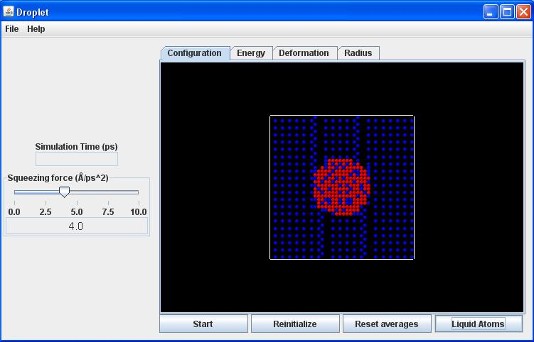
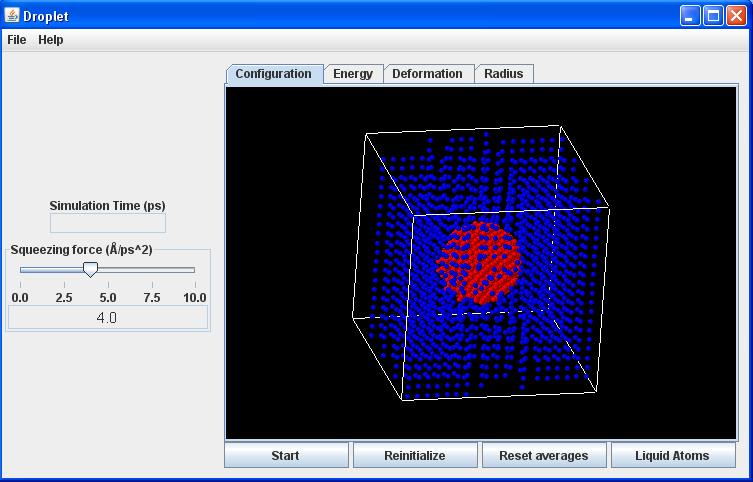
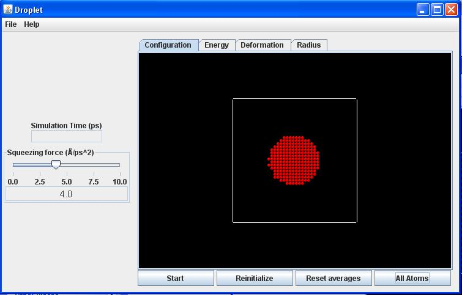
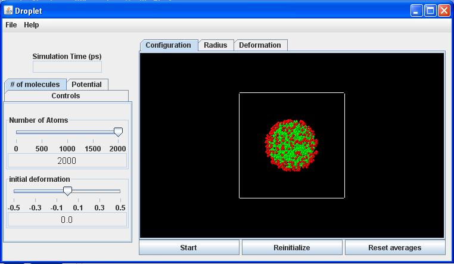
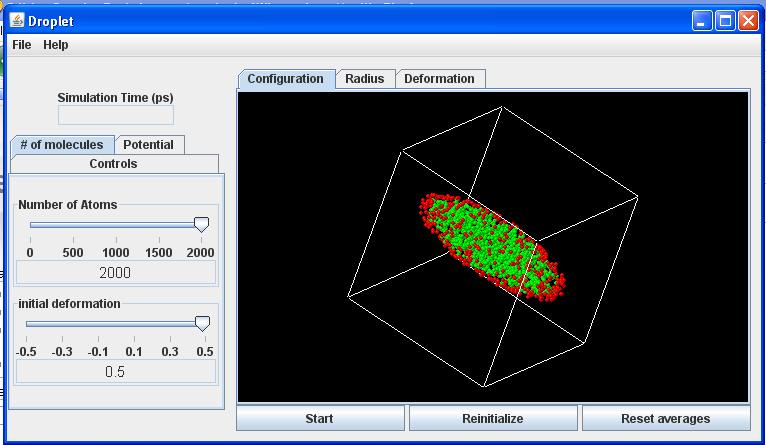
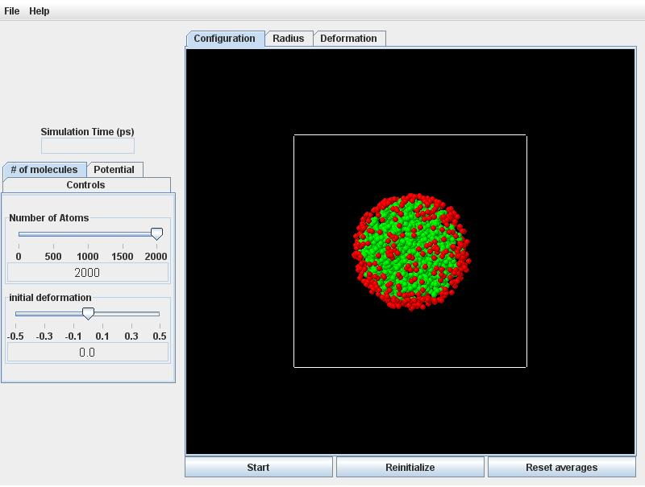
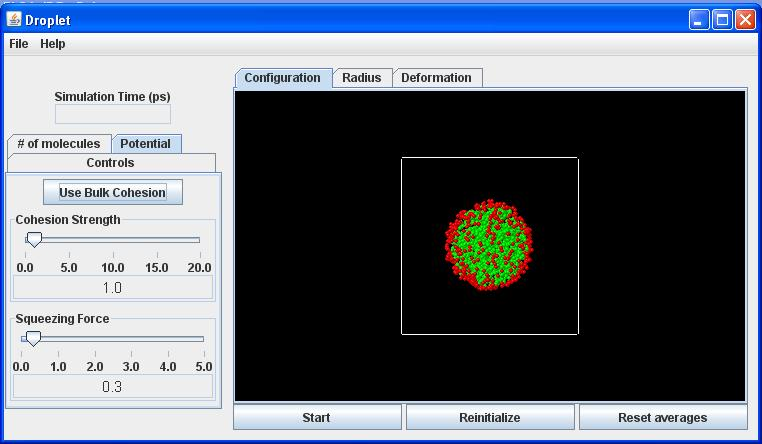

=Atomistic Simulation=

You can change the angle of view by pushing the left mouse button while the mouse arrow is in the view panel and then keeping it depressed while dragging in the desired direction.

## System key

**Blue atoms:** Vapor phase.

**Red atoms:** Liquid phase.

## Variable manipulation

***Squeezing force*** **slider:** Adjusts the strength of the opposing gravitational fields (units of Angstroms per square picosecond).

## Results

***Configuration*** **tab:** The default display - shows the positions of all atoms and their time evolution.

***Energy*** **tab:** Shows the total inter-atomic potential energy plotted cumulatively as a function of time.

'***Deformation*** **tab:** Shows the deformation parameter $D$ (of a spheroid fitted to the coordinates of all liquid atoms) plotted cumulatively as a function of time. $D = 0$ for an undeformed sphere. $D > 0$ for a prolate (rod-like) deformation. $D < 0$ for an oblate (disc-like) deformation.

***Radius*** **tab:** Shows the equivalent radius of the droplet plotted cumulatively as a function of time. A sphere of this radius has the same volume as the spheroidal shape fitted in the ***Deformation*** tab.

## Control buttons

***Start*** **button:** Launches the simulation.

***Reinitialize*** **button:** Resets the starting configuration of the atoms.

***Liquid Atoms*** **button:** Removes the (blue) atoms in the vapor phase to make the (red) atoms comprising the liquid droplet easier to see. Toggles back to the original view by clicking the ***All Atoms** button.*

=Continuum Simulation=

You can change the angle of view by pushing the left mouse button while the mouse arrow is in the view panel and then keeping it depressed while dragging in the desired direction.

## System key

**Red particles:** Surface particles.

**Green particles:** Interior particles.

## Controls (Variable Manipulation)

***Controls*** **tab:** This is the starting (default) view. Clicking here brings the **time step** slider to the foreground for adjustment.

***# of molecules*** **tab:** Used to set the initial configuration of the droplet.

:***Number of Atoms*** **slider:** A larger number will run slower, but yield more accurate results.

:***Initial Deformation*** **slider:** Choose between positive (prolate) and negative (oblate) deformations. You will want to rotate the view (see above) to discern  the different deformations.

***Potential*** **tab:** Used to set the cohesive and squeezing forces.

:***Use Surface Cohesion / Use Bulk Cohesion*** **button:** Toggles between just surface (red) particles attracting each other versus all (green and red) particles attracting each other, respectively. Each case has a slider control. The cohesive force may be varied between 0.0 and 20.0 for surface cohesion and between 0.4 and 1.0 for bulk cohesion.

:***Squeezing Force*** **slider:** Vary the squeezing force between 0.0 and 5.0.

## Results

***Configuration*** **tab:** The default display - shows the positions of all particles and their time evolution.

***Radius*** **tab:** Shows the sphere-equivalent radius of the droplet plotted cumulatively as a function of time. The starting value is 1, and deviations from this value as the simulation proceeds indicate (slight) deviations from volume conservation for the incompressible droplet.

***Deformation*** **tab:** Shows the deformation parameter $D$ (of a spheroid fitted to the coordinates of all liquid atoms) plotted cumulatively as a function of time. $D = 0$ for an undeformed sphere. $D > 0$ for a prolate (rod-like) deformation. $D < 0$ for an oblate (disc-like) deformation.

## Control buttons

***Start*** **button:** Launches the simulation.

***Reinitialize*** **button:** Creates a new random placement of particles, according to the overall parameters (number of particles, deformation) specified with the **Controls**.