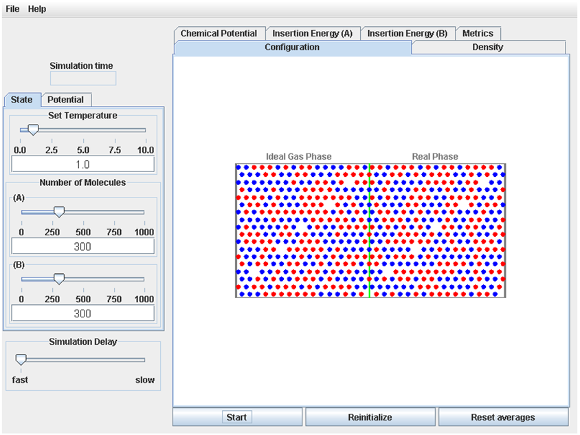

When the Chemical Potential Applet is started, the display will look like Figure 1 below.

The left side of the display contains 3 tabbed pages that allow the user to set the conditions for the simulation.  The “State” page has controls to allow the user to set the temperature (in reduced units), and the number of molecules of two species types (species A and species B).  The “Potential (A)”  tab allows the user to set the values of &sigma;A, &epsilon;A and &lambda;A that describe interactions between two A molecules, and the “Potential (B)”  tab allows the user to set values of &sigma;B, &epsilon;B and &lambda;B that describe interactions between two B molecules.

The bottom of the display has the user interface for controlling the operation of the simulation: The “Start” button is used to start the simulation (when the simulation is running, this button changes to a “Pause” button; after the simulation is paused, this button changes to a “Continue” button).  The “Reinitialize” button resets the simulation to its initial state.  The “Reset Averages” button makes the process for determining average properties begin again; this is useful so that averages can be collected from results after the system has come to equilibrium.  The “Simulation Delay” slider allows the simulation to be slowed, if the user wants to view the molecular trajectories more carefully.

The right side of the display contains 6 tabbed pages that display the results of the simulation:

1. The “Configuration” page shows the animation of the molecular trajectory (after the simulation is started).   The Ideal Gas Phase, where the molecules do not interact, is on the left side of the green line, and the Real Phase, where the molecules do interact, is on the in the right side of the green line.  The molecules are shown as circles.

2. The “Metrics” page displays numerical results for the average pressures of each phase; the average number densities of species A and B in each phase; and the average values of the quantity <exp(-(<VAR>&Delta;</VAR>Ei)/kT)> for i=species A and i=species B, in the Real Phase (the values of <exp(-(<VAR>&Delta;</VAR>Ei)/kT)> are not shown for the Ideal Gas Phase because they are simply 1).

3. The “Chemical Potential” page graphically displays the chemical potentials for species A and B, in both the Ideal Gas Phase and the Real Phase, as a function of time.

4. The “Density” page graphically displays the average number densities for species A and B, as a function of position in the system (note x<0 is the Ideal Gas Phase, and x>0 is the Real Phase).

5. The “Insertion Energy (A)” page gives the results for the insertion energies <VAR>&Delta;</VAR>Ei for i=species A.  Note that for the square-well potential only a limited number of discrete values of <VAR>&Delta;</VAR>Ei are possible; the results for <VAR>&Delta;</VAR>Ei are thus given as the probabilities of obtaining these discrete values of ∆Ei).  

6. The “Insertion Energy (B)” page gives the results for the insertion energies <exp(-(<VAR>&Delta;</VAR>Ei)/kT)> for i=species B.