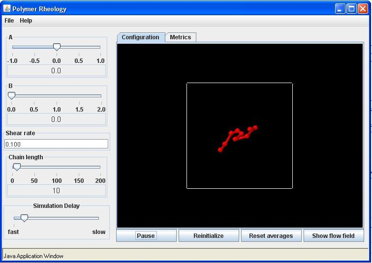
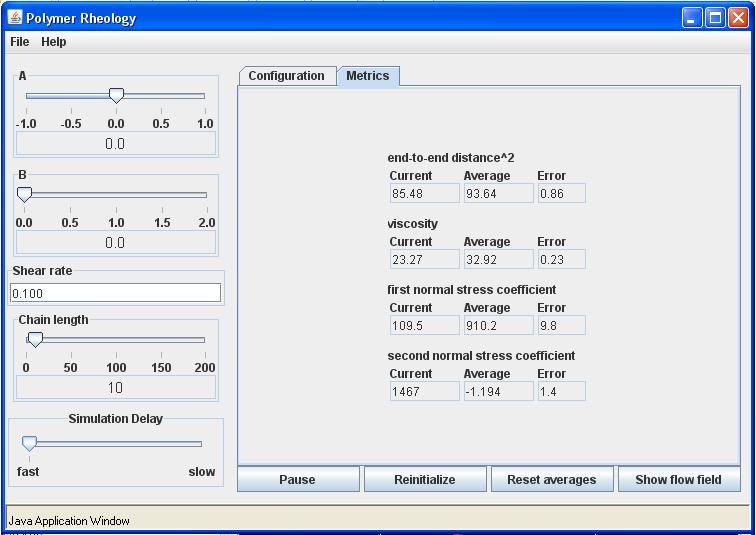

Polymer dynamics in shear flow

Rigid Rotation

Use the parameter setting of a = -1, b = 0, flow rate = 0, and chain length = 10.  Click the Start button.  You may also show the streamlines for the flow.  These will be perfectly circular.  This flow is rigid rotation and should have no effect on the chain configuration other than to rotate the chain about its center of mass.  Increase the flow rate by typing in different values, e.g., 1.0, 10.0, 100.0, etc.  Notice how the rate of rotation increases with increasing flow rate, but that the relative chain configurations do not.  That is, the  chain is not stretched by this flow.

Shear Flow

Use the parameter setting of a = 0, b = 0, flow rate = 0, and chain length = 10.  Start the simulation by clicking on the start button.  For shear flow, the flow rate is the shear rate.  Adjust the simulation delay slider so that you can clearly see the chain moving randomly.  Now set the flow rate to 0.1 and observe the chain dynamics.  The Configuration tab should look like this:

Click on show flow field to see the direction and magnitude of the suspending fluid velocity.  Now try several flow rates and observe the dynamics.  Notice that for large flow rates the chain will be stretched beyond the screen size.  You will still be able to simulate material functions for higher shear rates, but you will not be able to observe the chain dynamics.  
Now click on the metrics tab and record the values of the material functions once they have settled down.  You should run the simulation at the fastest speed to reach equilibrium most quickly.  The values will continue to fluctuate, so take an estimate of the average value.  These are dimensionless material function where we define a time constant  $\lambda_H =\frac{\zeta}{4H}$.  For shear flows we have analytical expressions for the three material functions given by:

$$
\frac{ \eta}{nKT\lambda_H } = \frac{N^2-1}{3}, \frac{ \Psi_1}{nKT\lambda_H^2 } = \frac{2(N^2-1)(2N^2+7)}{45}, and \frac{ \Psi_1}{nKT\lambda_H^2 } = 0
$$

The dimensionless properties on the left of the equal signs are the values shown in the Metrics tab.  Notice that these material functions for Hookean chains are independent of the shear rate.  Because of the random nature of the simulation, there will be some error, but you should get results close to the values give by the equations above. The end-to-end distance is also know analytically and is given by:

$$
\frac{<r^2>}{\frac{KT}{H} } = 3(N-1)+\frac{1}{15}N(N^4-1)\lambda_H^2\dot\gamma^2
$$

After running the simulation a sufficient amount of time, the Metrics tab should look like the following:

The results above compare well with the analytical results.  You will get about the same values for any flow rate.  Also, you may wish to try shorter chains such as N = 2 and check these results.  The simulations will converge much faster.

Finally repeat these shear rates for a nonlinear spring with b = 1.  You should notice that the chain does not stretch to large separations even in higher shear rates and that the material values are now dependent of the flow rate.