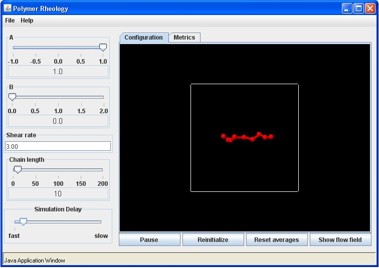
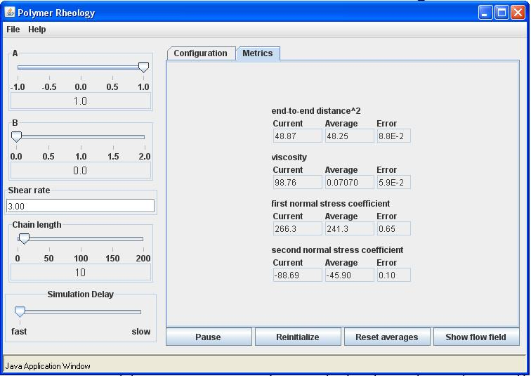

Polymer dynamics in Elongational flow

Starting with the parameter setting of a = 1, b = 0, flow rate = 0, and chain length = 10.  Your Configuration tab should look as follows:  

Start the simulation by clicking on the start button.  For planar elongational flow the flow rate is the elongation rate.  Adjust the simulation delay slider so that you can clearly see the chain moving randomly.  Now set the flow rate to 3.0 and observe the chain dynamics.  The Metrics tab should look similar to the following:

Click on show flow field to see the direction and magnitude of the suspending fluid velocity.  Now try several elongational rates and observe the dynamics.  As you increase the flow rate you should notice that the chain will align itself in the flow direction (i.e., the x-direction).  At a critical flow rate, the chain will suddenly become pulled apart by the flow.  Finally repeat these elongational rates for a nonlinear spring with b = 1.  You should notice that the chain does not stretch to large separations even in higher shear rates.

For the special case of linear springs with N = 2 (i.e., Hookean Dumbbells) we are able to calculate the material functions for all the possible two-dimensional flows.  The material functions for $a \le 0$ are as follows:

$\frac{\eta-\eta_s}{nkT\lambda_H} = \frac{(1+a)}{1-4a (\lambda_H\dot{\gamma})^2}$      the viscosity function

$\frac{\Psi_1}{nkT\lambda_H^2} = \frac{2(1+a)(1-a)}{1-4a (\lambda_H\dot{\gamma})^2}$  the first-normal stress coefficient

$\frac{\Psi_2}{nkT\lambda_H^2} = \frac{2a(1+a)}{1-4a (\lambda_H\dot{\gamma})^2}$  the second-normal stress coefficient

$$
\frac{<r^2>}{\frac{KT}{H} } = 3+\frac{2(1+a)^2(\lambda_H\dot{\gamma})^2}{1-4a (\lambda_H\dot{\gamma})^2}
$$

For flows with $a > 0$, these material properties are given by:

$\eta = (1-a) \frac{1-2\sqrt{a}\lambda_H\dot{\gamma}}{1-4a (\lambda_H\dot{\gamma})^2}$      the viscosity function

$\Psi_1 = \frac{4\sqrt{a}+2(1-a)^2\lambda_H\dot{\gamma}}{1-4a (\lambda_H\dot{\gamma})^2}$  the first-normal stress coefficient

$\Psi_2 = \frac{2\sqrt{a}-4a\lambda_H\dot{\gamma}}{1-4a (\lambda_H\dot{\gamma})^2}$  the second-normal stress coefficient

The averaged square end-to-end distance is the same expression for both cases.  These equation compare well with the average values calculated for N = 2.  Notice that for positive values of the parameter a, there is a singularity in the material properties.  For flows above a critical value of the flow rate given by $\lambda_H\dot{\gamma}= \frac{1}{2\sqrt{a}}$ the dumbbell will be pulled apart and have infinite values for the steady state material properties.  Finally, you should notice that although these flows all have vorticity, except when a = 1, the dumbbell or longer chains do not rotate with the vorticity.  In fact, for a>0 the chain will only flip over occasionally.  However, for a<0 the chains rotate noticeably.  This can be explained by a decomposing the vorticity into two portions.  One portion is objective and the chains need not rotate with this portion.  The other portion is not objective and requires the chains to rotate affinely with it.  At a = -1, the flow is all nonobjective rotation and the chains rotate completely with this flow.