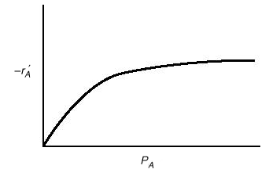

Determining the rate law parameters such as rate constants and reaction orders of reactants involved in a chemical reaction is an important task in chemical kinetics and reaction engineering.  In order to accomplish this, we need to recall the functional form of the rate law:

$-r_{A} = k{C_{A}}^{\alpha}{C_{B}}^{\beta}$&nbsp;&nbsp;&nbsp;&nbsp;&nbsp;&nbsp;&nbsp;(Equation 1)

which is simple power law model, applicable to a general reaction of the form:

$$
aA + bB \rightarrow cC + dD
$$

Other types of rate laws found in catalytic systems include Langmuir-Hinshelwood-Hougen-Watson (LHHW) rate laws, which take a form of type ("1 +"):

$$
-r_A = \frac{kC_A}{1+KC_A}
$$

(The above rate law might apply to the reaction $A \rightarrow Products$ on a catalytic surface.  For more information on these types of rate laws, see [http://www.engin.umich.edu/~cre/10chap/frames.htm,](http://www.engin.umich.edu/~cre/10chap/frames.htm,) or *Elements of Chemical Reaction Engineering* by [Fogler](Catalysis/References))

Quantifying reaction orders inherently requires reaction rate information.  Perhaps the convenient way to obtain quantitative reaction rate data is through a mole balance on the given chemical reactor.  For a batch reactor, one has:

$\frac{dC_A}{dt} = r_A$&nbsp;&nbsp;&nbsp;&nbsp;&nbsp;&nbsp;&nbsp;(Equation 5)

Combining equations (1) and (5) yields

$\frac{dC_A}{dt} = -k{C_{A}}^{\alpha}{C_{B}}^{\beta}$&nbsp;&nbsp;&nbsp;&nbsp;&nbsp;&nbsp;&nbsp;(Equation 6)

From the mole balance, one can notice that quantitative information on the rate of reaction may be deduced from the instantaneous rate of change of concentration with time.  In other words, if one possesses concentration versus time data, one can determine reaction orders.

There are several methods available to regress reaction orders, including the differential, integral, and non-linear least-squares analysis (ref fogler; [http://www.engin.umich.edu/~cre/05chap/frames.htm.](http://www.engin.umich.edu/~cre/05chap/frames.htm.)  (It should be noted that Polymath [http://www.polymath-software.com/](http://www.polymath-software.com/) is an excellent tool for regression analysis.)

If one is interested in determining the rate of reaction directly from concentration versus time data using the differential method, one of three methods is used: graphical, polynomial, finite-differences, or non-linear least-squares analysis.  (For more information, see chapter 5 of Fogler or [http://www.engin.umich.edu/~cre/05chap/frames.htm.)](http://www.engin.umich.edu/~cre/05chap/frames.htm.))  Once rates of reaction have been determined at the various experimental reaction times, one may graph the rate of reaction versus a particular reactant concentration (or partial pressure), as shown below,

(Figure taken from [http://www.engin.umich.edu/~cre/10chap/images/uacd10-1.gif,](http://www.engin.umich.edu/~cre/10chap/images/uacd10-1.gif,) *Elements of Chemical Reaction Engineering* by Fogler.)

Reaction orders may be deduced from plots such as these.  When making plots of $-r_A$ versus reactant concentration (partial pressure) it is important to remember to hold the concentration (or partial pressure) of the other reactants, as well as the reaction temperature, constant.