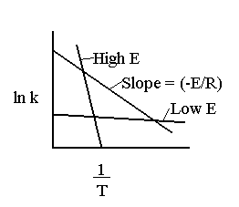

The main effect of temperature on the rate of a chemical reaction comes through the specific rate constant, *k*.  The effect of temperature on *k* is described by the Arrhenius law, which states

$k = Aexp \left ( \frac{-E_a}{RT} \right)$ &nbsp;&nbsp;&nbsp;&nbsp;&nbsp;&nbsp;&nbsp;(Equation 2)

where *A* is the pre-exponential factor (related to the entropy changes associated with forming the transition state from the initial reactants) and *Ea* is the activation energy, or the energy barrier that must be surmounted in order to form products.  Part of our goal in performing a reaction engineering analysis of a chemical reaction is to determine the Arrhenius parameters *A* and *Ea*, so that we may predict correct rate constants at any given reaction temperature.

The starting point for this analysis is a collection of *k* versus temperature data.  Often, the specific values of *k* come from non-linear least-squares regression, simultaneous with determining [reaction orders](Catalysis/Determination of Rate Law Parameters).

The determination of *A* and *Ea* is often made graphically, through the use of an Arrhenius plot.  To create such a plot, one takes the natural log of equation (2) above, to obtain:

$ln(k) = A - \frac{E_a}{RT}$ &nbsp;&nbsp;&nbsp;&nbsp;&nbsp;&nbsp;&nbsp;(Equation 7)

Plotting ln(*k*) versus 1/T according to equation (7) above yields the following linear graph:

(Figure taken from [http://www.engin.umich.edu/~cre/course/lectures/three/pics/lec5-26.gif,](http://www.engin.umich.edu/~cre/course/lectures/three/pics/lec5-26.gif,) *Elements of Chemical Reaction Engineering* by Fogler [^1])

From this type of plot, *A* is equal to the intercept and *Ea* is equal to the $-R\times(slope)$

[^1]: Fogler, H. S., *Elements of Chemical Reaction Engineering*, 4th Edition, Prentice-Hall, Inc., Englewood Cliffs (2005).