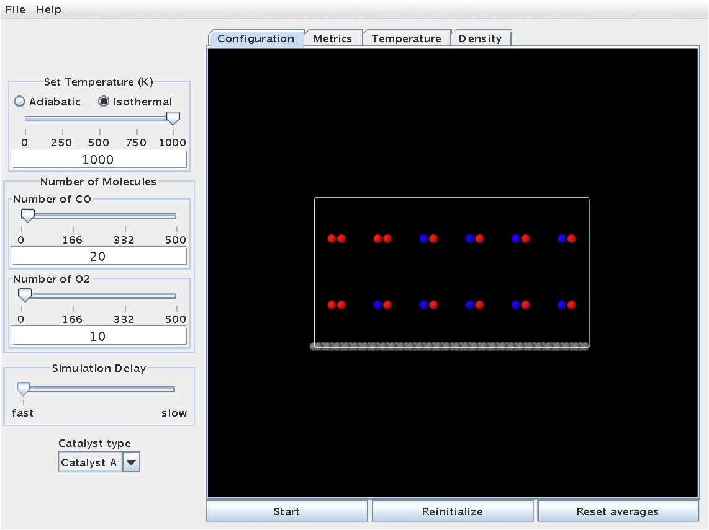
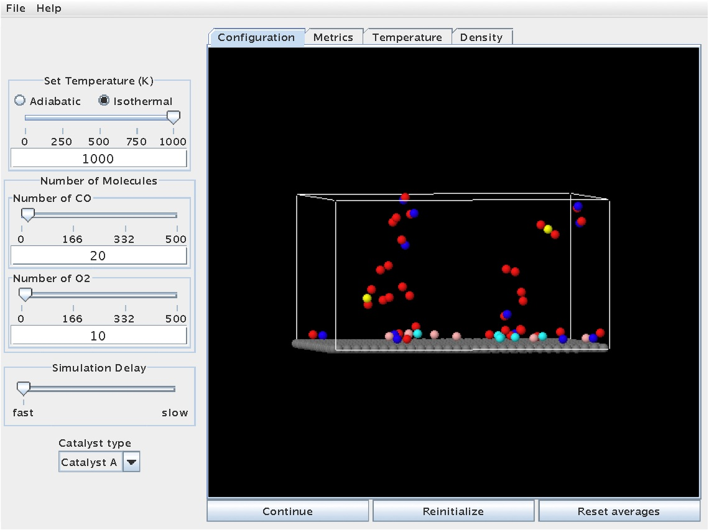
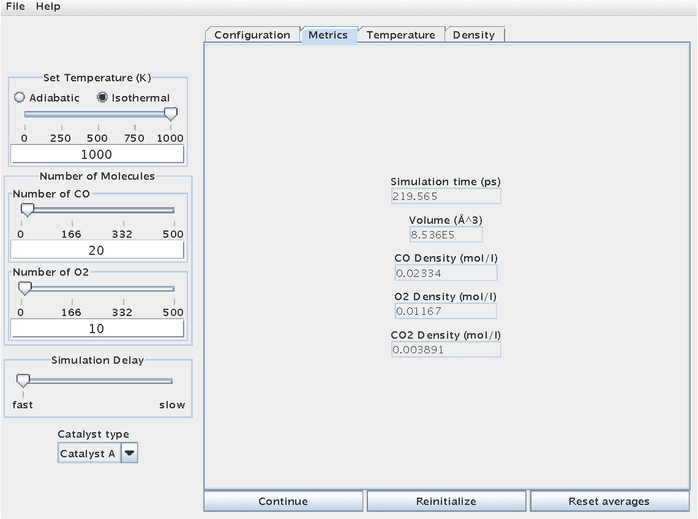
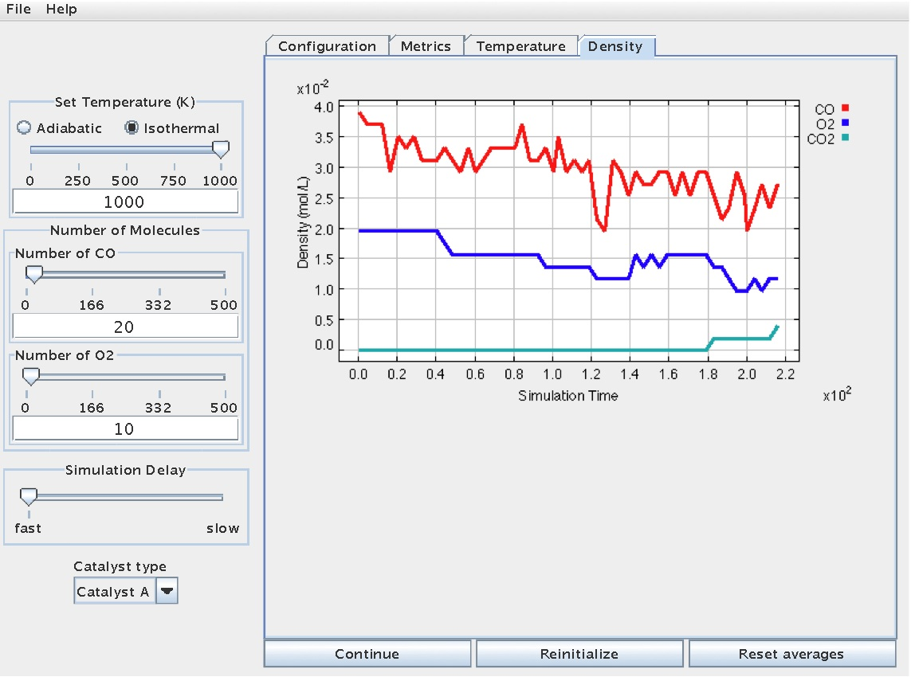
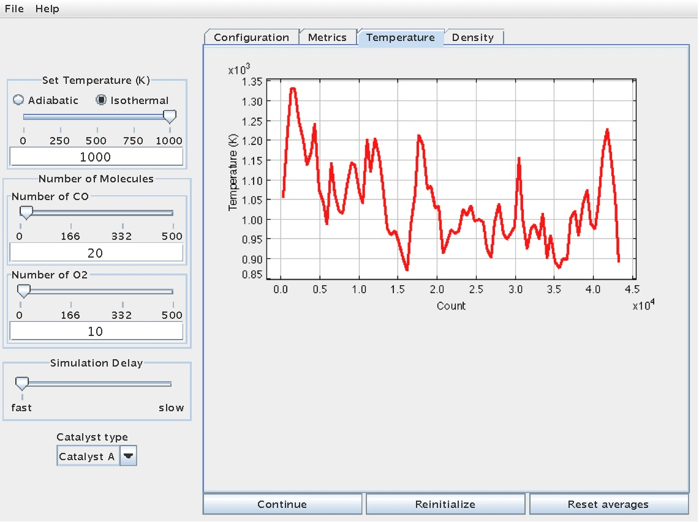

To illustrate the operation of the etomica Catalysis module, consider the following example.

Suppose one wants to simulate CO oxidation under the following conditions:

- Isothermal reaction temperature of 1000 K

- Initial, stoichiometric mixture of 20 CO molecules and 10 O2 molecules

- Using catalyst type A

To set up this simulation, make sure to do the following:

- Make sure you are on the "Configuration" tab of the module
- Select the "Isothermal" button within the "Set Temperature" cell

- Set the temperature to be 1000 (K), using either the slider, or by entering the number manually

- Within the "Number of Molecules" cell, increase the number of CO molecules to 20, using either the slider, or by entering the number manually

- Within the "Number of Molecules" cell, increase the number of O2 molecules to 10, using either the slider, or by entering the number manually

- From the drop-down menu titled "Catalyst type", be sure "Catalyst A" is selected

This initial screen should look like the one below:

The simulation can be started by hitting the "Start" button.  Once started, the molecules will move throughout the gas phase and even interact with the surface.  At certain points, molecules or atoms may bond to the surface.  The snapshot below shows a reaction in progress, with molecules dispersed throughout the gas phase and some molecules/atoms stuck on the surface (note the color change for atoms/molecules on the surface - cyan and light grey):

As the reaction proceeds further, CO2 molecules will eventually form.  This will be evident from the color change of the C atom to yellow.  The snapshot below shows the reaction at a time when two CO2 molecules have been produced:

With regard to collecting data, the "Metrics" tab contains information regarding simulation/reaction time, reactor volume (fixed), and species concentration:

This same information is available graphically on the "Density" tab:

Concentration versus time data can be used to infer [reaction rate information](Catalysis/Determination of Rate Law Parameters), and to help [regress/determine thermodynamic and kinetic parameters](Catalysis/Determination of Arrhenius Parameters) related to a given rate law.

In addition, temperature information during the reaction can be viewed from the "Temperature" tab:

This information can useful for thermodynamic analyses, including energy balance calculations.