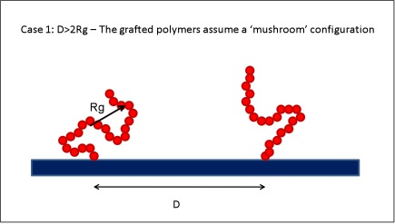
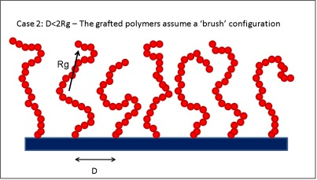
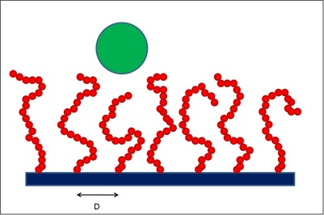
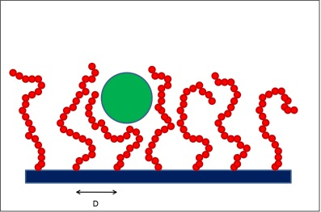
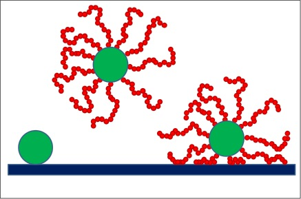

## Colloidal Brushes 

Colloidal dispersions are extremely important technologically. They are related to, e.g., enhanced oil recovery, protein purification, drug delivery, and, more recently, stabilization of systems containing nanoparticles (e.g., carbon nanotubes). Typically, because of enthalpic reasons, colloids (particles that are larger than typical solvent molecules, but small enough that their behavior can be described using statistical mechanics approaches) attract each other when dispersed in common solvents. This attraction may lead to flocculation and precipitation. Controlling these phenomena is tricky, and is often done exploiting entropic effects. For example, when high molecular weight compounds, e.g., non-adsorbing polymers, are dispersed in the system, an effective colloid-colloid attraction may arise because the polymers cannot fit in between two approaching colloids (hence the term depletion attraction, introduced in the 1950’s by Asakura and Oosawa). These controlled attractions may lead to the formation of, e.g., protein crystals. Vice versa, to induce colloid-colloid repulsion, and thus to prevent precipitation out of solution, short polymer chains can be grafted on the colloids, generating ‘colloidal brushes’. When two such brushes approach each other the free volume available to each of the grafted chains decreases, and effective colloid-colloid repulsions arise.

## Brushes on Surfaces 

Polymer brushes are often used to prevent the adsorption of colloidal particles onto surfaces. Applications such as drug-delivery devices,[1,2] chromatography,[3] and anti-fouling surfaces[4-6] have greatly benefitted from the design of appropriate brushes. The general idea is to graft polymers onto the flat surface. When the distance D between the grafting points is larger than twice the radius of gyration Rg the polymers assume a conformation known as ‘mushroom’, while when D<2Rg polymer brushes are obtained. In the latter regime the polymer extends away from the surface to minimize the entropy losses due to the presence of the neighboring grafted chains.

##= Solid surface with sparsely grafted polymer chains. =
When the distance between grafting sites D is larger than twice the radius of gyration of the polymer Rg the grafted polymers assume a ‘mushroom’ configuration because they do not interact with each other.

##= Solid surface with densely grafted polymer chains. =
When the distance between grafting sites D is less than twice the radius of gyration of the polymer Rg the grafted polymers assume a ‘brush’ configuration. Note that the polymer chains extend away from the surface.

Because compression of the equilibrated brush by an external colloidal particle gives rise to entropic penalties, an effective repulsion arises between the colloidal particle and the polymer brush.[7] Similar phenomena are expected when the polymer chains are grafted on a colloidal particle to prevent its adsorption onto a flat wall. The latter strategies have for example been successfully employed to extend the circulation lifetime of liposomes in the blood stream.[2]

The compression of a polymer brush by a solid particle has been studied extensively both theoretically[8-14] and experimentally, for example with the use of the surface force apparatus (SFA)[15,16] and of the atomic force microscope (AFM).[17-21] The experimental data typically show a repulsive force that monotonically increases as the distance between surfaces (SFA), or that between surface and particle (AFM) decreases. Fitting the experimental data to modifications of the Alexander-de Gennes theory[22] can lead to realistic estimates for thickness and grafting density of the polymer brushes.

Under appropriate circumstances, if the grafted polymer can adsorb on both the surface that bears the brush and on the colloidal particle, then attractions may arise due to bridging phenomena.[23] Experimental reports are available concerning bridging forces.[24-29] The necessary ingredients for observing bridging interactions are attractive forces between polymer segments and surface, but also the availability of adsorption sites for the polymer segments. At high grafting density (e.g., in a dense brush) the lack of available binding sites may in fact prevent the polymer from forming bridges.[30] When the grafted polymers are at ‘good’ solvent conditions it is generally unexpected to observe bridging attractions because the polymer segments are more likely to remain free in solution than to adsorb onto the surface.

 
##= Interaction between a colloidal particle and a polymer brush. =
As a colloidal particle (green sphere) approaches the solid surface, the grafted polymer chains need to rearrange because of excluded-volume effects. This leads to entropic penalties, which effectively induce colloid-brush repulsive interactions.

----

This module intends to explore the interplay between enthalpic and entropic effects for a system containing colloidal brushes. Instead of grafting the polymer chains on the flat surface, the polymer chains are grafted on the colloidal particle. The general principles described above apply to the colloid brush – surface interacting system, as schematically represented in the figure below.
 

##= Colloidal brushes interacting with a flat surface. =
When a colloidal particle (green sphere) is attracted to a flat surface (left) it is possible to prevent adsorption by grafting polymer chains onto the colloid surface (center). However, if the polymer segments are attracted to the solid surface it is possible that bridging attraction effectively brings the colloidal brush at contact with the surface (right). Enthalpy drives adsorption of the pristine colloidal particle (left) and of the colloidal brush in the presence of bridging attractions (right). Entropy prevents the colloidal brush adsorption when the polymer chains are at ‘good’ solvent conditions (center).

----

The goal of this module is to understand how one colloidal brush interacts with a flat surface. One practical application is for example the control of the circulation lifetime of liposomes in the blood stream for controlled drug-delivery reasons. The colloids (liposomes) are naturally attracted to the surfaces (blood vessels). To prolong the circulation lifetime we seek to induce effective colloid-surface repulsions. Conventional wisdom suggests that by grafting short polymer chains (usually PEO) the adsorption on the wall decreases and the circulation lifetime increases. However, the module demonstrates that when the polymer segments are attracted to the flat surface it is possible that enthalpic effects (which are favorably to polymer adsorption) prevail on entropic ones (which oppose the colloidal brush adsorption).