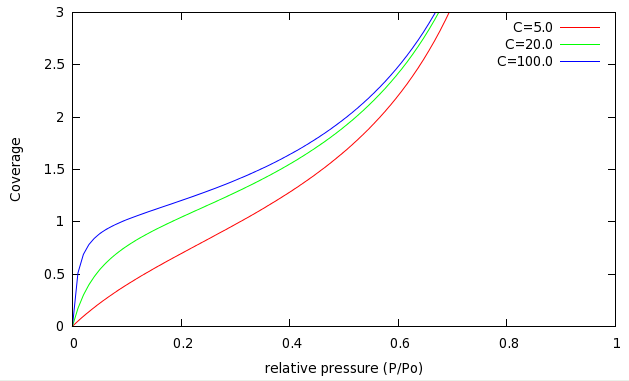

The Langmuir isotherm is only accurate under conditions where the underlying assumptions are accurate: low pressures (so that molecules don't try and adsorb on top of each other), and strong adsorbents (so that intermolecular interactions in the adsorbed layer can safely be neglected.)  

The Brunauer-Emmett-Teller (BET) model [J. Am. Chem. Soc. 1938, vol. 60, pp. 309-310](http://pubs.acs.org/doi/abs/10.1021/ja01269a023) is an improvement on the Langmuir isotherm which incorporates *multilayer* adsorption and treats the intermolecular interactions in the adsorbed layer by assuming that it is liquid-like.  The resulting equation gives the surface coverage $\theta$ as a function of the relative pressure $P/P_0$ and a constant $C$ which measures the strength of the adsorbent.  The "linear" form of this model is:

$$
\frac{1}{\theta(P_0/P - 1)} = \frac{1}{C} + \frac{C-1}{C}P/P_0
$$

where

$C \propto e^{(E_a - \Delta H_{vap})/kT}$.

$C$ is simply the inverse Boltzmann factor of the 'excess' adsorption energy
beyond that required to liquify the gas;  to *remove* the adsorbed layer requires an input of
$\Delta H_{vap} - E_a$ enthalpy, basically.

If we solve for the coverage, we get:

$$
\theta = \frac{C \cdot P/P_0}{1 + (C-2)P/P_0 - (C-1)(P/P_0)^2}
$$

BET isotherms for several values of $C$ are shown in the following plot:

There are several important things to note here.  First of all, the coverage can be greater than 1.0, which corresponds to
multilayer adsorption. This was not possible in the Langmuir model, but happens even at fairly low pressure in the BET model.

Secondly, at low pressures ($P/P_0 < 0.1$) the BET isotherm resembles the Langmuir isotherms (on the previous page.)  As you
increase the value of $C$ (making a stronger adsorbent), the pressure where $\theta = 1$ becomes lower and
lower, meaning that we complete the first monolayer earlier and earlier.  At high pressures, the isotherms all look much the
same. This is because molecules in the third (and above) layers do not interact with the surface at all - they only see the other
molecules adsorbed below them.

At high pressures ($P/P_0 \rightarrow 1$) the BET isotherm *diverges*, meaning that a macroscopically thick layer
of adsorbed fluid grows at the surface.  This is known as *wetting.*

At low pressures, we can ignore the quadratic term in the denominator of the second form of the BET equation.  Furthermore,
if we also assume that $C-2 \simeq C$, this equation is just the Langmuir isotherm, with $C = K/P_0$.

## Surface Area determination 
The BET model is not exact, and tends to fail at both high pressures (thick adsorbed layer) and very low pressures.  In practice,
one typically chooses a pressure range $0.05 < P/P_0 < 0.30$ or so, and rewrites the isotherm using $\theta = [A(ads)]/[S]_0$,
to give:

$$
\frac{1}{[A(ads)](P_0/P - 1)} = \frac{1}{C[S]_0} + \frac{C-1}{C[S]_0}P/P_0
$$

by plotting $1/[A(ads)](P_0/P - 1)$ vs $P/P_0$, you get a straight line.  From the slope and intercept, you can
then solve for the monolayer capacity $[S]_0$ and the constant $C$.  From $[S]_0$ and the area covered by a single molecule of adsorbate, you can get the surface area.

By using this pressure range, one focuses on the area of the isotherm from 0.5 to 1.5 monolayers' coverage.