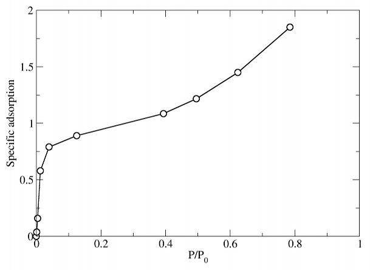
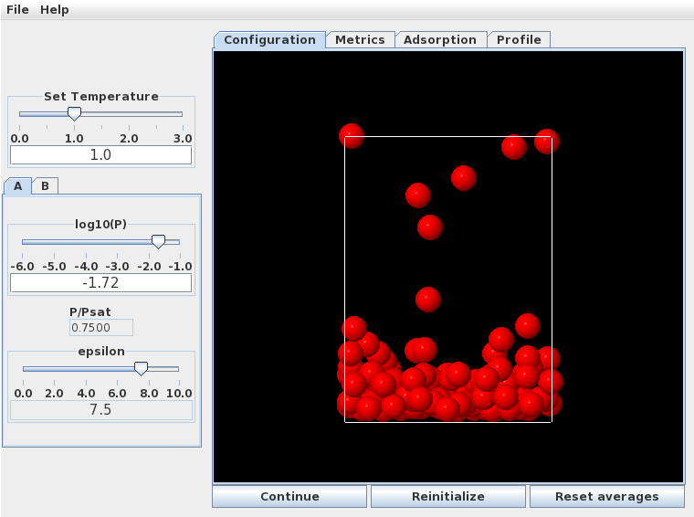
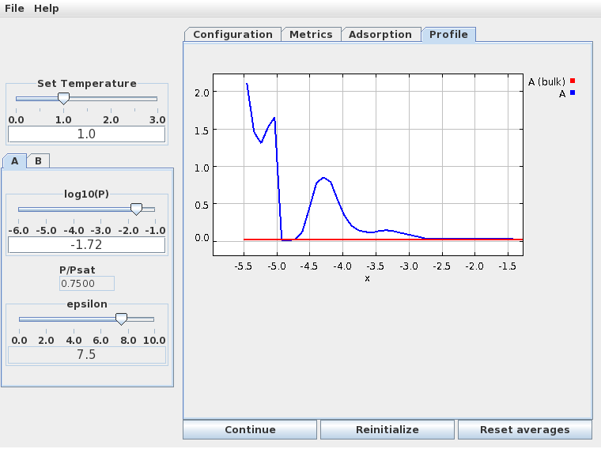

Here we'll look at the basic shape of the adsorption isotherm, and describe how to do
some of the calculations.

We generate an isotherm by starting at low pressure and measuring the amount of gas 
adsorbed at successively higher pressures, in steps.  At each pressure we need to wait a short
time for the system to equilibrate, after which we collect data for long enough to 
obtain a good average adsorption.  Generally, 100-1000 time units are sufficient
for equilibration after a small change in pressure, and collecting data for
1000-10000 time units will give good results.

Do these calculations at T=1.0, and with a surface-fluid interaction strength of eps = 7.5,
corresponding to a strongly adsorbing surface such as graphite.

At low temperatures and/or on strongly adsorbing surfaces, the simulations can be
quite long, especially in the sub-monolayer pressure region. This is because the rates of
escape from the adsorbed layer back into the gas phase are very low, and so the amount of
adsorbed gas fluctuates and evolves only very slowly.  In these cases, longer data collections
may be required. This kind of behavior is easy to see in the simulation window.

The isotherm under these conditions looks very much like the BET prediction for a strongly
adsorbing material:

At low pressures a monolayer forms by $P/P_0 = 0.1$. At higher pressures ($P/P_0 = 0.75$, specific adsorption approximately 1.6), a multilayer structure forms. This is quite disordered, as seen in the snapshot below.

The density profile normal to the surface (below) clearly shows the formation of a second monolayer
(at much lower density than the first), and even a hint of a third.

In this figure the "x" variable measures the distance from the top of the simulation cell; the adsorbing
wall as at the bottom.  The first monolayer corresponds to the high density region 
between -5.5 and -4.75, the second monolayer is the broader peak centered at -4.25, and the 
beginning of a third monolayer is the small peak at -3.25.  The third layer is very disordered and not
really visible in the simulation snapshot - but its there!