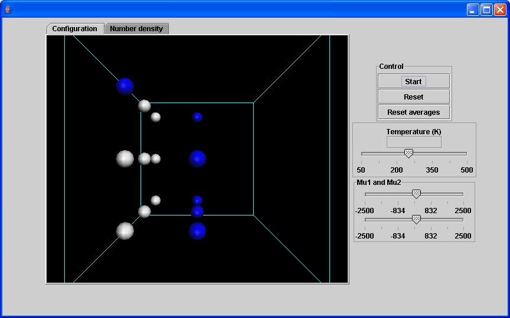

When you start up the applet, you should encounter a window that looks something like this:

The first item on the "Control Panel" is the "Control Box", which contains buttons that :
{{ControlBox-nav}}

Where you can

* Change the Temperature 
* Change the values of mu, to change the chemical potential difference

The following table outlines the features available for manipulating the three dimensional figure.

| Key/Mouse Combination | Function |
| - | - |
| h | Move figure to home (original) position. |
| r | Center the figure on the display.  If the figure is rotated, it will remain rotated. |
| x or X | Rotate figure around the X axis.  Case of letter determines direction of rotation. |
| y or Y | Rotate figure around the Y axis.  Case of letter determines direction of rotation. |
| z or Z | Rotate figure around the Z axis.  Case of letter determines direction of rotation. |
| = | Zoom in on center of graphic. |
| - | Zoom out on center of graphic. |
| p | Toggle &quot;perspective&quot; on/off. |
| 1 - 9 | Set the number of &quot;shells&quot; to display. |
| i | Toggle &quot;shell&quot; display on/off. |
| a | Toggle molecule display on/off. |
| Left Mouse Button + Mouse Drag | Rotate the figure in the direction of the mouse drag (only applicable to X and Y axis. |
| Right Mouse Button + Mouse Drag | Move the figure in the direction of the mouse drag. |
| Ctrl + Left Mouse Button + Mouse Drag | Set depth percentage. |
| Ctrl + Right Mouse Button + Mouse Drag | Set slab percentage. |
| Shift + Left Mouse Button + Mouse Drag Up | Zoom in on center of graphic. |
| Shift + Left Mouse Button + Mouse Drag Down | Zoom out on center of graphic. |
| Shift + Right Mouse Button + Mouse Drag | Inertially rotate in direction of mouse drag. |
| Shift + Right Mouse Button Click | Stop Inertial rotation. |
| Ctrl + Shift + Left Mouse Button Drag | Rotate around the Z axis. |
