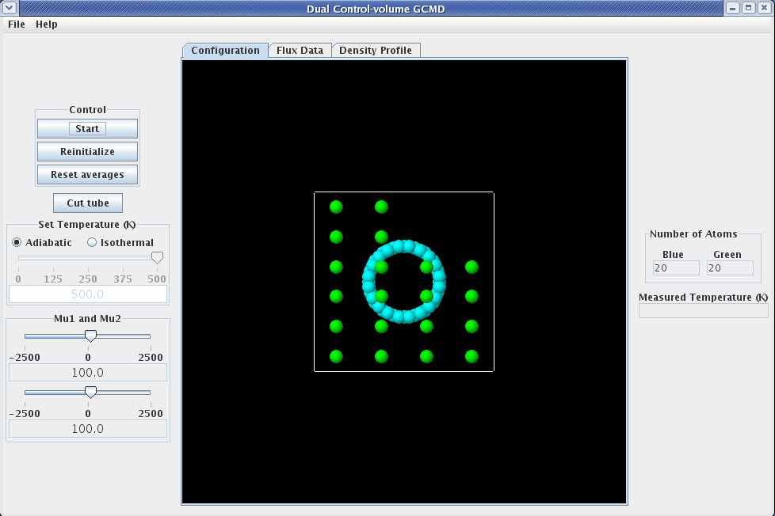

When the DCVGCMD with nanotube application is started, it should look something like this:





The left side of the display, referred to as the "Control Panel", contains controls that allow the user to interact with the simulation. 

The first item on the "Control Panel" is the "Control Box", which contains buttons that :
{{ControlBox-nav}}

The next item on the "Control Panel" is the **cut tube button**. When the **cut tube button** is pushed, the tube on the graphic, which is shown as a light blue cylinder, is cut in half so the user can see what is happening inside the tube. To restore the tube image to its fully displayed state, push the **cut tube button** again (button will read "Restore" when tube is displayed in cut state). The image below shows the graphic after the **cut tube button** has been pushed. Note that the graphic has been rotated from its original position. Details on how to rotate the graphic are detailed later on this page.


The next item on the "Control Panel" is the temperature control that permits setting the simulation as adiabatic or isothermal with the **temperature selection** radio buttons. If the **temperature selection** setting is isothermal, the **temperature slider** becomes available and allows the simulation temperature to be controlled.

Change the values of mu, to change the chemical potential difference.

The middle section of the display is referred to as the "Grahpics Panel". The graphic displayed on the "Graphics Panel" shows the atoms as spheres. Although the image appears two dimensional it is actually three dimensional.

The following table outlines the features available for manipulating the three dimensional figure.

The following table outlines the features available for manipulating the three dimensional figure.

```
<table width="80%" border="2">
<tr>
<td width="35%" align="center">
<b>Key/Mouse Combination</b>
<td width="65%" align="center">
<b>Function</b>
</tr>
<tr>
<td width="35%" align="left">
h
<td width="65%" align="left">
Move figure to home (original) position.
</tr>
<tr>
<td width="35%" align="left">
r
<td width="65%" align="left">
Center the figure on the display.  If the figure is rotated, it will remain rotated.
</tr>
<tr>
<td width="35%" align="left">
x or X
<td width="65%" align="left">
Rotate figure around the X axis.  Case of letter determines direction of rotation.
</tr>
<tr>
<td width="35%" align="left">
y or Y
<td width="65%" align="left">
Rotate figure around the Y axis.  Case of letter determines direction of rotation.
</tr>
<tr>
<td width="35%" align="left">
z or Z
<td width="65%" align="left">
Rotate figure around the Z axis.  Case of letter determines direction of rotation.
</tr>
<tr>
<td width="35%" align="left">
=
<td width="65%" align="left">
Zoom in on center of graphic.
</tr>
<tr>
<td width="35%" align="left">
-
<td width="65%" align="left">
Zoom out on center of graphic.
</tr>
<tr>
<td width="35%" align="left">
p
<td width="65%" align="left">
Toggle &quot;perspective&quot; on/off.
</tr>
<tr>
<td width="35%" align="left">
1 - 9
<td width="65%" align="left">
Set the number of &quot;shells&quot; to display.
</tr>
<tr>
<td width="35%" align="left">
i
<td width="65%" align="left">
Toggle &quot;shell&quot; display on/off.
</tr>
<tr>
<td width="35%" align="left">
a
<td width="65%" align="left">
Toggle molecule display on/off.
</tr>
<tr>
<td width="35%" align="left">
Left Mouse Button + Mouse Drag
<td width="65%" align="left">
Rotate the figure in the direction of the mouse drag (only applicable to X and Y axis.
</tr>
<tr>
<td width="35%" align="left">
Right Mouse Button + Mouse Drag
<td width="65%" align="left">
Move the figure in the direction of the mouse drag.
</tr>
<tr>
<td width="35%" align="left">
Ctrl + Left Mouse Button + Mouse Drag
<td width="65%" align="left">
Set depth percentage.
</tr>
<tr>
<td width="35%" align="left">
Ctrl + Right Mouse Button + Mouse Drag
<td width="65%" align="left">
Set slab percentage.
</tr>
<tr>
<td width="35%" align="left">
Shift + Left Mouse Button + Mouse Drag Up
<td width="65%" align="left">
Zoom in on center of graphic.
</tr>
<tr>
<td width="35%" align="left">
Shift + Left Mouse Button + Mouse Drag Down
<td width="65%" align="left">
Zoom out on center of graphic.
</tr>
<tr>
<td width="35%" align="left">
Shift + Right Mouse Button + Mouse Drag
<td width="65%" align="left">
Inertially rotate in direction of mouse drag.
</tr>
<tr>
<td width="35%" align="left">
Shift + Right Mouse Button Click
<td width="65%" align="left">
Stop Inertial rotation.
</tr>
<tr>
<td width="35%" align="left">
Ctrl + Shift + Left Mouse Button Drag
<td width="65%" align="left">
Rotate around the Z axis.
</tr>
</table>
```

On the far right is the "Data Display Panel" 

The "Data Display Panel" contains several display elements that report data from the simulation, including the count of each type of atom (**blue atom meter** and **green atom meter**) and the current temperature (**temperature meter**).