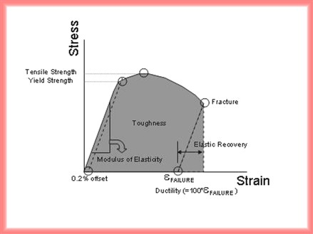
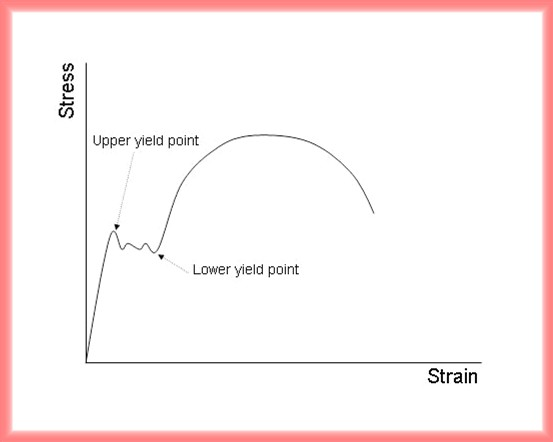

*Stress-Strain Curve*

The stress-strain curve is produced from the tensile test.

 

 

The engineering stress is

$$
sigma = \frac{P}{A_0}
$$

P is the load on the specimen and Ao is the original cross-sectional area near the center of the specimen. On the other hand, the true stress is the load devided by the true area, which continues to be smaller by the tensile load. The true stress continues to increase to the point of fracture, while the engineering stress decreases to the point of fracture due to the increasing load and the constant cross-sectional area. The engineering strain is

$$
\varepsilon = \frac{l -l_0}{l_0}
$$

l is the gage length at a given load and lo is the original gage length with zero load

*Information of Stress-Strain Curve*

The stress-strain curve can be devided into two distinct deformation regions, which are the elastic deformation and the plastic deformation. The elastic deformation is temporary and is fully recovered when the load is removed. The plastic deformation is permanent and is not recovered when the load is removed, even though a small portion of elasitic part in the deformation is recovered. The recovered portion is called the elastic recovery. 
The point deviating between the elastic region and the plastic region is often difficult to specify in the curve. The usual convention is to define the yield strength, which is the intersection of the curve with a straight line parallel to the elastic deformation and offset 0.2% on the strain axis. The yield strength( Y.S.) represents the stress necessary to generate the small amount of permanent deformation and indicates the degree of easiness which the material can be formed by rolling and drawing operations. 
The slope of the stress-strain curve in the elastic deformation region is the modulus of elasticity, which is known as Young's modulus. It represents the stiffness of the material-resistance to elastic strain. The description of Hooke's law can also be found from the slope.

$$
\sigma = E\varepsilon
$$

E is the modulus of elasticity or Young's modulus. As the plastic deformation continues in the curve above the yield strength, the engineering stress reaches to a maximum point, which is called the tensile strength( T.S.). 
The plastic deformation produces dislocations within the region in the curve between Y.S. and T.S.. The increasing dislocation density makes the plastic deformation harder. This phenomenon is the strain hardening and a key factor in shaping the material by cold work.
The srain at failure occurs after the specimen fractures. It is the interaction point of the plastic recovery region in strain axis. It is known as ductility. The ductility is the percent elongation at failure and indicates that the general ability of the material to be plastically deformed.
The toughness is used to describe the combination of strength and ductility. This is defined as total area under the stress-strain curve. A high strength alloy that is also highly brittle may not be usable as a deformable alloy with a low strength. Two extreme cases are shown below.

Along with the modulus of elasticity, the Poisson's ratio is the fundamental description of the elastic behavior although it is not directly appeared in the stress-strain curve.
For certain materials, especially low-carbon steel alloys, the stress-strain curve produces an upper yield point and a lower yield point.

The material produces a nonhomogeneous deformation in the elastic region. This comes from a contraction perpendicular to the extention by a tensile load. This effect is characterized by the Poisson's ratio.

$$
\nu = \frac{\varepsilon_x}{\varepsilon_y}
$$

ex is the strain in x direction and ey is the strain in y direction