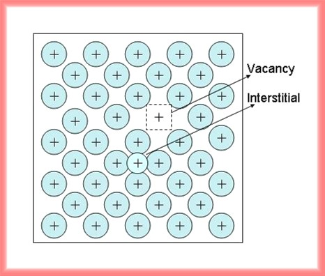
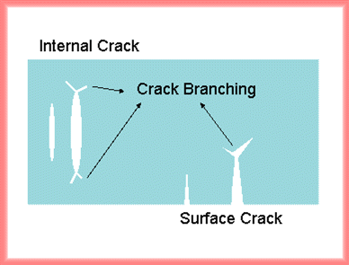

*Defects*
 
Zero dimensional imperfections associated with the crystalline lattice are called 'point defects'. Two common types of point defects are the vacancy, which is formed by removal of an atom from its lattice site, and the interstitial, which is an atom occupying an interstitial site. Defects naturally exist in materials in a way to release excess internal stress. Defect structures can be complex due to electron trapping or electron-hole trapping at point defects. One dimensional linear defects, which is known as dislocations, can be associated with mechnical deformation in materials.

*Cracks*

Origin of cracks comes from the nucleation of defecs or/and a local disorder of the arragement of atoms. There are two main types of cracks, which are the surface crack and the internal crack. Based on the direction and the magnitude of applied stress, those evolve into several macroscopic fractures by crack propagation, which is the basic mechanism of failure of materials. Once cracks propagate by external stress, cracks accelerate to a relatively steady velocity. A local phonon field moves with the crack tip. The field storing the energy of broken bonds causes the emission of dislocations. Multi-branching of cracks might occur along the slip plane due to the braching instability when the crack propagation reaches or exceed a critical velocity.

