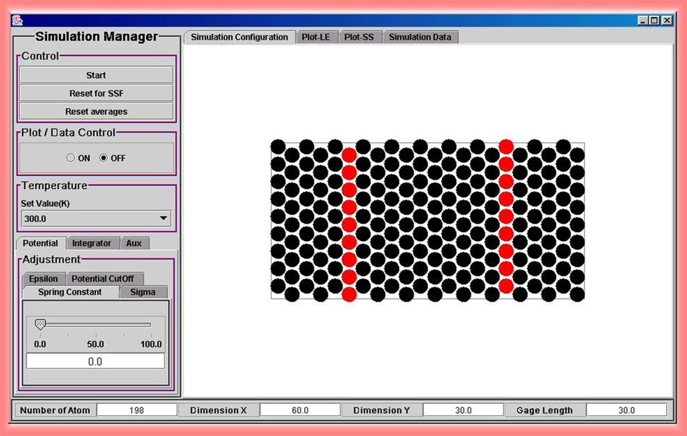

When the Stress Strain Fracture Simulation is loaded a basic layout, as shown below, should appear.

The simulation is controlled by the buttons and tabs to the left of the window. These controls are sectioned into four main categories. (General Control, Plot/Data Control, Temperature set up and other Adjustment). The tabs located above the simulation display control what kind of the display shows. The simulation has the capability to display the molecules themselves, the load-elongation plot, the stress-strain plot and the data of both present and average values. 

At the top under the Control section, are buttons to start/stop the simulation and reset the simulation. Either averages of the recorded data or the entire simulation can be reset from these buttons. 

Below the Control Section, there is the Plot/Data Control section. This section allows the simulation to record data and to display plots. It is important to remember to turn on this control button after the simulation reaches to a initial equilibrium state. The recorded data or plots can then be viewed by selecting the Simulation Data tab located above the main display. 

Next is the Temperature section. The user can set one of 7 different temperatures before running the simulation. Adiabatic system also can be studied simply choose the option of 'adiabatic'. While the simulation is running, the temperature can not be reset. 

Below the Temperature section, there is a section of other adjustments. This section has three main tabs: Potential, Integrator, and Auxiliary tabs. These control different areas of the simulation. The Potential tab allows the user to control the force and molecular properties. Under this tab there are four separate tabs. 
* Epsilon: The Epsilon tab controls the epsilon value, which is a well depth of Lennard-Jones potential between molecules. By changing the epsilon value the force of attraction between the molecules will change. 
* Sigma: The Sigma tab controls the size of the molecules. By changing the sigma value the diameter of the molecules will change. 
* Spring Constant: The spring constant is the k value in Hooke's law. By changing this value the external force applied in the simulation will change. 
* Potential CutOff: The Potential CutOff tab changes the distance at which molecules feel the forces of other molecules. By changing this value the distance at which molecules affect other molecules can be altered. Also, in the simulation, this property helps to identify cracks and vacancies inside materials. A crack or vacancy occurs when molecular radii of interaction no longer overlap. 

The second tab is the Integrator tab. This tab has two sub-tabs, Time Step and Anderson Nu. The Time Step tab controls the time increments used in calculations of the equation of motion to run the simulation. Increasing the value speeds up the simulation. The Anderson Nu controls the time it takes for the system to reach the given temperature. While small steps make the simulation run slow, it is a good condition to catch some microscopic phenamina in detail. 

The third tab is the Aux tab. This tab provides for control of the auxiliary options in the simulation. 
* Potential Cutoff: The Potential Cutoff tab allows the user to show the potential cutoff region in display. 
* Config Shape: The Config Shape tab allows the user to select the original starting lattice structure. The lattice can either be a triangular shape, similar to that of the face centered cubic lattice structure, or a square shape, which corresponds to the simple cubic lattice structure. 
* Gage Length: The Gage Length tab allows the user to determine the Gage Length which the simulation will run under. The Gage Length is the length at which the force is mainly applied at. 
* Potential Field: The Potential Field tab allows the user to activate a visual display which shows the force field acting on the overall system. 
* Inflate: The Inflate tab allows the user to change the display size of the simulation. 

Along the top just above the main display are four tabs. These tabs control what the main display shows. The Simulation Configuration allows the main display to be shown. This helps to visualize what is happening inside the lattice structure. The Plot LE tab allows the user to access the Load vs. Elongation plot. This shows of much the lattice has changed in length due to the load applied. The Plot SS tab allows the user to access the Stress vs. Strain plot. This plot shows the relationship to the applied load per area and the change in length from the original length. The Simulation Data tab allows the user to access both present and average data for the simulation.